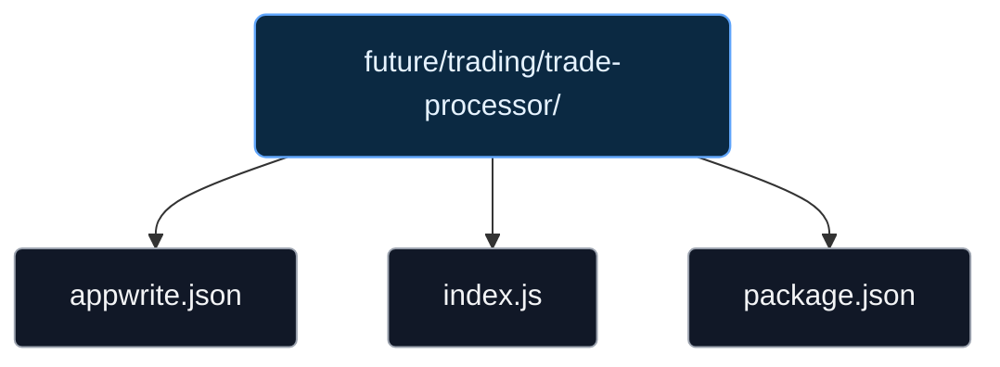

# Project Map — future/trading/trade-processor

```mermaid
flowchart TB
  classDef folder fill:#0b2942,stroke:#60a5fa,stroke-width:1.2,color:#e5f2ff,rx:6,ry:6
  classDef file fill:#111827,stroke:#9ca3af,stroke-width:1,color:#f3f4f6,rx:4,ry:4
  future_trading_trade_processor["future/trading/trade-processor/" ]
  class future_trading_trade_processor folder
  future_trading_trade_processor_appwrite_json["appwrite.json"]
  class future_trading_trade_processor_appwrite_json file
  future_trading_trade_processor --> future_trading_trade_processor_appwrite_json
  future_trading_trade_processor_index_js["index.js"]
  class future_trading_trade_processor_index_js file
  future_trading_trade_processor --> future_trading_trade_processor_index_js
  future_trading_trade_processor_package_json["package.json"]
  class future_trading_trade_processor_package_json file
  future_trading_trade_processor --> future_trading_trade_processor_package_json
```
