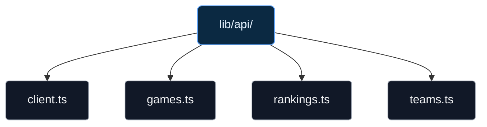

# Project Map — lib/api

```mermaid
flowchart TB
  classDef folder fill:#0b2942,stroke:#60a5fa,stroke-width:1.2,color:#e5f2ff,rx:6,ry:6
  classDef file fill:#111827,stroke:#9ca3af,stroke-width:1,color:#f3f4f6,rx:4,ry:4
  lib_api["lib/api/" ]
  class lib_api folder
  lib_api_client_ts["client.ts"]
  class lib_api_client_ts file
  lib_api --> lib_api_client_ts
  lib_api_games_ts["games.ts"]
  class lib_api_games_ts file
  lib_api --> lib_api_games_ts
  lib_api_rankings_ts["rankings.ts"]
  class lib_api_rankings_ts file
  lib_api --> lib_api_rankings_ts
  lib_api_teams_ts["teams.ts"]
  class lib_api_teams_ts file
  lib_api --> lib_api_teams_ts
```
