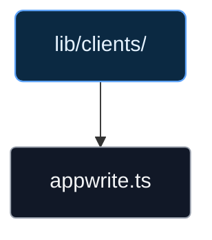

# Project Map — lib/clients

```mermaid
flowchart TB
  classDef folder fill:#0b2942,stroke:#60a5fa,stroke-width:1.2,color:#e5f2ff,rx:6,ry:6
  classDef file fill:#111827,stroke:#9ca3af,stroke-width:1,color:#f3f4f6,rx:4,ry:4
  lib_clients["lib/clients/" ]
  class lib_clients folder
  lib_clients_appwrite_ts["appwrite.ts"]
  class lib_clients_appwrite_ts file
  lib_clients --> lib_clients_appwrite_ts
```
