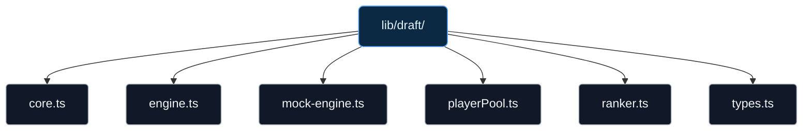

# Project Map — lib/draft

```mermaid
flowchart TB
  classDef folder fill:#0b2942,stroke:#60a5fa,stroke-width:1.2,color:#e5f2ff,rx:6,ry:6
  classDef file fill:#111827,stroke:#9ca3af,stroke-width:1,color:#f3f4f6,rx:4,ry:4
  lib_draft["lib/draft/" ]
  class lib_draft folder
  lib_draft_core_ts["core.ts"]
  class lib_draft_core_ts file
  lib_draft --> lib_draft_core_ts
  lib_draft_engine_ts["engine.ts"]
  class lib_draft_engine_ts file
  lib_draft --> lib_draft_engine_ts
  lib_draft_mock_engine_ts["mock-engine.ts"]
  class lib_draft_mock_engine_ts file
  lib_draft --> lib_draft_mock_engine_ts
  lib_draft_playerPool_ts["playerPool.ts"]
  class lib_draft_playerPool_ts file
  lib_draft --> lib_draft_playerPool_ts
  lib_draft_ranker_ts["ranker.ts"]
  class lib_draft_ranker_ts file
  lib_draft --> lib_draft_ranker_ts
  lib_draft_types_ts["types.ts"]
  class lib_draft_types_ts file
  lib_draft --> lib_draft_types_ts
```
