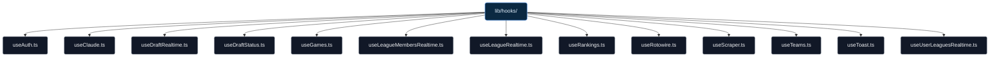

# Project Map — lib/hooks

```mermaid
flowchart TB
  classDef folder fill:#0b2942,stroke:#60a5fa,stroke-width:1.2,color:#e5f2ff,rx:6,ry:6
  classDef file fill:#111827,stroke:#9ca3af,stroke-width:1,color:#f3f4f6,rx:4,ry:4
  lib_hooks["lib/hooks/" ]
  class lib_hooks folder
  lib_hooks_useAuth_ts["useAuth.ts"]
  class lib_hooks_useAuth_ts file
  lib_hooks --> lib_hooks_useAuth_ts
  lib_hooks_useClaude_ts["useClaude.ts"]
  class lib_hooks_useClaude_ts file
  lib_hooks --> lib_hooks_useClaude_ts
  lib_hooks_useDraftRealtime_ts["useDraftRealtime.ts"]
  class lib_hooks_useDraftRealtime_ts file
  lib_hooks --> lib_hooks_useDraftRealtime_ts
  lib_hooks_useDraftStatus_ts["useDraftStatus.ts"]
  class lib_hooks_useDraftStatus_ts file
  lib_hooks --> lib_hooks_useDraftStatus_ts
  lib_hooks_useGames_ts["useGames.ts"]
  class lib_hooks_useGames_ts file
  lib_hooks --> lib_hooks_useGames_ts
  lib_hooks_useLeagueMembersRealtime_ts["useLeagueMembersRealtime.ts"]
  class lib_hooks_useLeagueMembersRealtime_ts file
  lib_hooks --> lib_hooks_useLeagueMembersRealtime_ts
  lib_hooks_useLeagueRealtime_ts["useLeagueRealtime.ts"]
  class lib_hooks_useLeagueRealtime_ts file
  lib_hooks --> lib_hooks_useLeagueRealtime_ts
  lib_hooks_useRankings_ts["useRankings.ts"]
  class lib_hooks_useRankings_ts file
  lib_hooks --> lib_hooks_useRankings_ts
  lib_hooks_useRotowire_ts["useRotowire.ts"]
  class lib_hooks_useRotowire_ts file
  lib_hooks --> lib_hooks_useRotowire_ts
  lib_hooks_useScraper_ts["useScraper.ts"]
  class lib_hooks_useScraper_ts file
  lib_hooks --> lib_hooks_useScraper_ts
  lib_hooks_useTeams_ts["useTeams.ts"]
  class lib_hooks_useTeams_ts file
  lib_hooks --> lib_hooks_useTeams_ts
  lib_hooks_useToast_ts["useToast.ts"]
  class lib_hooks_useToast_ts file
  lib_hooks --> lib_hooks_useToast_ts
  lib_hooks_useUserLeaguesRealtime_ts["useUserLeaguesRealtime.ts"]
  class lib_hooks_useUserLeaguesRealtime_ts file
  lib_hooks --> lib_hooks_useUserLeaguesRealtime_ts
```
