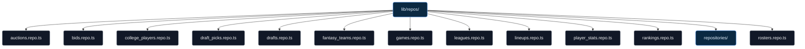

# Project Map — lib/repos

```mermaid
flowchart TB
  classDef folder fill:#0b2942,stroke:#60a5fa,stroke-width:1.2,color:#e5f2ff,rx:6,ry:6
  classDef file fill:#111827,stroke:#9ca3af,stroke-width:1,color:#f3f4f6,rx:4,ry:4
  lib_repos["lib/repos/" ]
  class lib_repos folder
  lib_repos_auctions_repo_ts["auctions.repo.ts"]
  class lib_repos_auctions_repo_ts file
  lib_repos --> lib_repos_auctions_repo_ts
  lib_repos_bids_repo_ts["bids.repo.ts"]
  class lib_repos_bids_repo_ts file
  lib_repos --> lib_repos_bids_repo_ts
  lib_repos_college_players_repo_ts["college_players.repo.ts"]
  class lib_repos_college_players_repo_ts file
  lib_repos --> lib_repos_college_players_repo_ts
  lib_repos_draft_picks_repo_ts["draft_picks.repo.ts"]
  class lib_repos_draft_picks_repo_ts file
  lib_repos --> lib_repos_draft_picks_repo_ts
  lib_repos_drafts_repo_ts["drafts.repo.ts"]
  class lib_repos_drafts_repo_ts file
  lib_repos --> lib_repos_drafts_repo_ts
  lib_repos_fantasy_teams_repo_ts["fantasy_teams.repo.ts"]
  class lib_repos_fantasy_teams_repo_ts file
  lib_repos --> lib_repos_fantasy_teams_repo_ts
  lib_repos_games_repo_ts["games.repo.ts"]
  class lib_repos_games_repo_ts file
  lib_repos --> lib_repos_games_repo_ts
  lib_repos_leagues_repo_ts["leagues.repo.ts"]
  class lib_repos_leagues_repo_ts file
  lib_repos --> lib_repos_leagues_repo_ts
  lib_repos_lineups_repo_ts["lineups.repo.ts"]
  class lib_repos_lineups_repo_ts file
  lib_repos --> lib_repos_lineups_repo_ts
  lib_repos_player_stats_repo_ts["player_stats.repo.ts"]
  class lib_repos_player_stats_repo_ts file
  lib_repos --> lib_repos_player_stats_repo_ts
  lib_repos_rankings_repo_ts["rankings.repo.ts"]
  class lib_repos_rankings_repo_ts file
  lib_repos --> lib_repos_rankings_repo_ts
  lib_repos_repositories["repositories/"]
  class lib_repos_repositories folder
  lib_repos --> lib_repos_repositories
  click lib_repos_repositories "/admin/project-map/lib/repos/repositories" "Open repositories"
  lib_repos_rosters_repo_ts["rosters.repo.ts"]
  class lib_repos_rosters_repo_ts file
  lib_repos --> lib_repos_rosters_repo_ts
```
