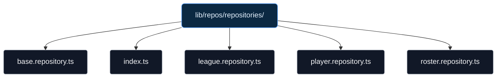

# Project Map — lib/repos/repositories

```mermaid
flowchart TB
  classDef folder fill:#0b2942,stroke:#60a5fa,stroke-width:1.2,color:#e5f2ff,rx:6,ry:6
  classDef file fill:#111827,stroke:#9ca3af,stroke-width:1,color:#f3f4f6,rx:4,ry:4
  lib_repos_repositories["lib/repos/repositories/" ]
  class lib_repos_repositories folder
  lib_repos_repositories_base_repository_ts["base.repository.ts"]
  class lib_repos_repositories_base_repository_ts file
  lib_repos_repositories --> lib_repos_repositories_base_repository_ts
  lib_repos_repositories_index_ts["index.ts"]
  class lib_repos_repositories_index_ts file
  lib_repos_repositories --> lib_repos_repositories_index_ts
  lib_repos_repositories_league_repository_ts["league.repository.ts"]
  class lib_repos_repositories_league_repository_ts file
  lib_repos_repositories --> lib_repos_repositories_league_repository_ts
  lib_repos_repositories_player_repository_ts["player.repository.ts"]
  class lib_repos_repositories_player_repository_ts file
  lib_repos_repositories --> lib_repos_repositories_player_repository_ts
  lib_repos_repositories_roster_repository_ts["roster.repository.ts"]
  class lib_repos_repositories_roster_repository_ts file
  lib_repos_repositories --> lib_repos_repositories_roster_repository_ts
```
