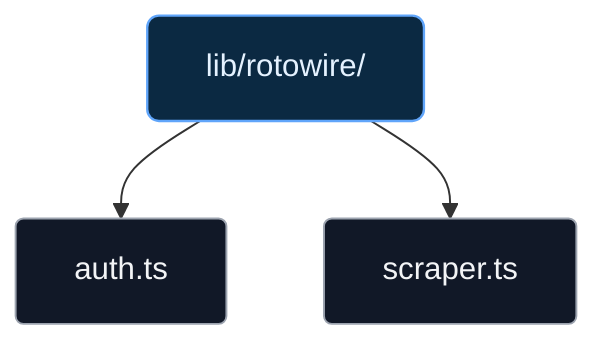

# Project Map — lib/rotowire

```mermaid
flowchart TB
  classDef folder fill:#0b2942,stroke:#60a5fa,stroke-width:1.2,color:#e5f2ff,rx:6,ry:6
  classDef file fill:#111827,stroke:#9ca3af,stroke-width:1,color:#f3f4f6,rx:4,ry:4
  lib_rotowire["lib/rotowire/" ]
  class lib_rotowire folder
  lib_rotowire_auth_ts["auth.ts"]
  class lib_rotowire_auth_ts file
  lib_rotowire --> lib_rotowire_auth_ts
  lib_rotowire_scraper_ts["scraper.ts"]
  class lib_rotowire_scraper_ts file
  lib_rotowire --> lib_rotowire_scraper_ts
```
