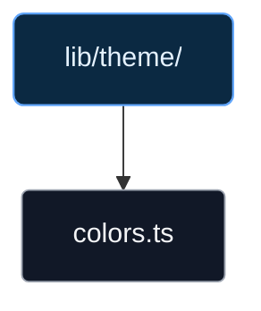

# Project Map — lib/theme

```mermaid
flowchart TB
  classDef folder fill:#0b2942,stroke:#60a5fa,stroke-width:1.2,color:#e5f2ff,rx:6,ry:6
  classDef file fill:#111827,stroke:#9ca3af,stroke-width:1,color:#f3f4f6,rx:4,ry:4
  lib_theme["lib/theme/" ]
  class lib_theme folder
  lib_theme_colors_ts["colors.ts"]
  class lib_theme_colors_ts file
  lib_theme --> lib_theme_colors_ts
```
