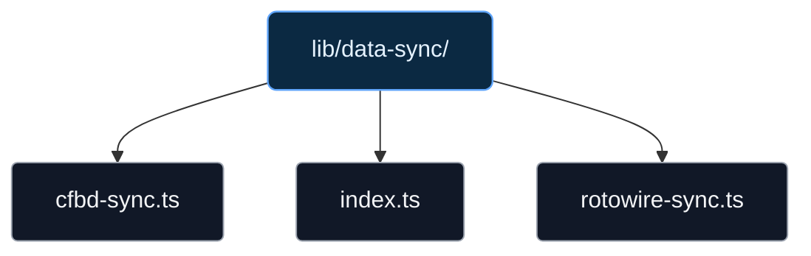

# Project Map — lib/data-sync

```mermaid
flowchart TB
  classDef folder fill:#0b2942,stroke:#60a5fa,stroke-width:1.2,color:#e5f2ff,rx:6,ry:6
  classDef file fill:#111827,stroke:#9ca3af,stroke-width:1,color:#f3f4f6,rx:4,ry:4
  lib_data_sync["lib/data-sync/" ]
  class lib_data_sync folder
  lib_data_sync_cfbd_sync_ts["cfbd-sync.ts"]
  class lib_data_sync_cfbd_sync_ts file
  lib_data_sync --> lib_data_sync_cfbd_sync_ts
  lib_data_sync_index_ts["index.ts"]
  class lib_data_sync_index_ts file
  lib_data_sync --> lib_data_sync_index_ts
  lib_data_sync_rotowire_sync_ts["rotowire-sync.ts"]
  class lib_data_sync_rotowire_sync_ts file
  lib_data_sync --> lib_data_sync_rotowire_sync_ts
```
