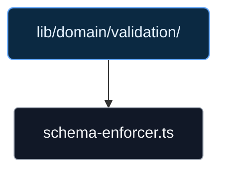

# Project Map — lib/domain/validation

```mermaid
flowchart TB
  classDef folder fill:#0b2942,stroke:#60a5fa,stroke-width:1.2,color:#e5f2ff,rx:6,ry:6
  classDef file fill:#111827,stroke:#9ca3af,stroke-width:1,color:#f3f4f6,rx:4,ry:4
  lib_domain_validation["lib/domain/validation/" ]
  class lib_domain_validation folder
  lib_domain_validation_schema_enforcer_ts["schema-enforcer.ts"]
  class lib_domain_validation_schema_enforcer_ts file
  lib_domain_validation --> lib_domain_validation_schema_enforcer_ts
```
