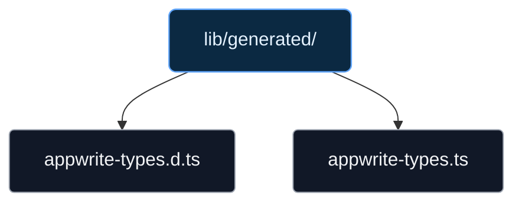

# Project Map — lib/generated

```mermaid
flowchart TB
  classDef folder fill:#0b2942,stroke:#60a5fa,stroke-width:1.2,color:#e5f2ff,rx:6,ry:6
  classDef file fill:#111827,stroke:#9ca3af,stroke-width:1,color:#f3f4f6,rx:4,ry:4
  lib_generated["lib/generated/" ]
  class lib_generated folder
  lib_generated_appwrite_types_d_ts["appwrite-types.d.ts"]
  class lib_generated_appwrite_types_d_ts file
  lib_generated --> lib_generated_appwrite_types_d_ts
  lib_generated_appwrite_types_ts["appwrite-types.ts"]
  class lib_generated_appwrite_types_ts file
  lib_generated --> lib_generated_appwrite_types_ts
```
