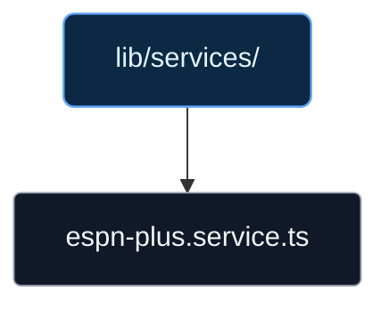

# Project Map — lib/services

```mermaid
flowchart TB
  classDef folder fill:#0b2942,stroke:#60a5fa,stroke-width:1.2,color:#e5f2ff,rx:6,ry:6
  classDef file fill:#111827,stroke:#9ca3af,stroke-width:1,color:#f3f4f6,rx:4,ry:4
  lib_services["lib/services/" ]
  class lib_services folder
  lib_services_espn_plus_service_ts["espn-plus.service.ts"]
  class lib_services_espn_plus_service_ts file
  lib_services --> lib_services_espn_plus_service_ts
```
