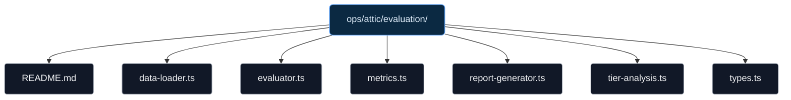

# Project Map — ops/attic/evaluation

```mermaid
flowchart TB
  classDef folder fill:#0b2942,stroke:#60a5fa,stroke-width:1.2,color:#e5f2ff,rx:6,ry:6
  classDef file fill:#111827,stroke:#9ca3af,stroke-width:1,color:#f3f4f6,rx:4,ry:4
  ops_attic_evaluation["ops/attic/evaluation/" ]
  class ops_attic_evaluation folder
  ops_attic_evaluation_README_md["README.md"]
  class ops_attic_evaluation_README_md file
  ops_attic_evaluation --> ops_attic_evaluation_README_md
  ops_attic_evaluation_data_loader_ts["data-loader.ts"]
  class ops_attic_evaluation_data_loader_ts file
  ops_attic_evaluation --> ops_attic_evaluation_data_loader_ts
  ops_attic_evaluation_evaluator_ts["evaluator.ts"]
  class ops_attic_evaluation_evaluator_ts file
  ops_attic_evaluation --> ops_attic_evaluation_evaluator_ts
  ops_attic_evaluation_metrics_ts["metrics.ts"]
  class ops_attic_evaluation_metrics_ts file
  ops_attic_evaluation --> ops_attic_evaluation_metrics_ts
  ops_attic_evaluation_report_generator_ts["report-generator.ts"]
  class ops_attic_evaluation_report_generator_ts file
  ops_attic_evaluation --> ops_attic_evaluation_report_generator_ts
  ops_attic_evaluation_tier_analysis_ts["tier-analysis.ts"]
  class ops_attic_evaluation_tier_analysis_ts file
  ops_attic_evaluation --> ops_attic_evaluation_tier_analysis_ts
  ops_attic_evaluation_types_ts["types.ts"]
  class ops_attic_evaluation_types_ts file
  ops_attic_evaluation --> ops_attic_evaluation_types_ts
```
