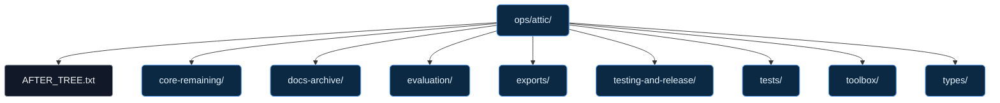

# Project Map — ops/attic

```mermaid
flowchart TB
  classDef folder fill:#0b2942,stroke:#60a5fa,stroke-width:1.2,color:#e5f2ff,rx:6,ry:6
  classDef file fill:#111827,stroke:#9ca3af,stroke-width:1,color:#f3f4f6,rx:4,ry:4
  ops_attic["ops/attic/" ]
  class ops_attic folder
  ops_attic_AFTER_TREE_txt["AFTER_TREE.txt"]
  class ops_attic_AFTER_TREE_txt file
  ops_attic --> ops_attic_AFTER_TREE_txt
  ops_attic_core_remaining["core-remaining/"]
  class ops_attic_core_remaining folder
  ops_attic --> ops_attic_core_remaining
  click ops_attic_core_remaining "/admin/project-map/ops/attic/core-remaining" "Open core-remaining"
  ops_attic_docs_archive["docs-archive/"]
  class ops_attic_docs_archive folder
  ops_attic --> ops_attic_docs_archive
  click ops_attic_docs_archive "/admin/project-map/ops/attic/docs-archive" "Open docs-archive"
  ops_attic_evaluation["evaluation/"]
  class ops_attic_evaluation folder
  ops_attic --> ops_attic_evaluation
  click ops_attic_evaluation "/admin/project-map/ops/attic/evaluation" "Open evaluation"
  ops_attic_exports["exports/"]
  class ops_attic_exports folder
  ops_attic --> ops_attic_exports
  click ops_attic_exports "/admin/project-map/ops/attic/exports" "Open exports"
  ops_attic_testing_and_release["testing-and-release/"]
  class ops_attic_testing_and_release folder
  ops_attic --> ops_attic_testing_and_release
  click ops_attic_testing_and_release "/admin/project-map/ops/attic/testing-and-release" "Open testing-and-release"
  ops_attic_tests["tests/"]
  class ops_attic_tests folder
  ops_attic --> ops_attic_tests
  click ops_attic_tests "/admin/project-map/ops/attic/tests" "Open tests"
  ops_attic_toolbox["toolbox/"]
  class ops_attic_toolbox folder
  ops_attic --> ops_attic_toolbox
  click ops_attic_toolbox "/admin/project-map/ops/attic/toolbox" "Open toolbox"
  ops_attic_types["types/"]
  class ops_attic_types folder
  ops_attic --> ops_attic_types
  click ops_attic_types "/admin/project-map/ops/attic/types" "Open types"
```
