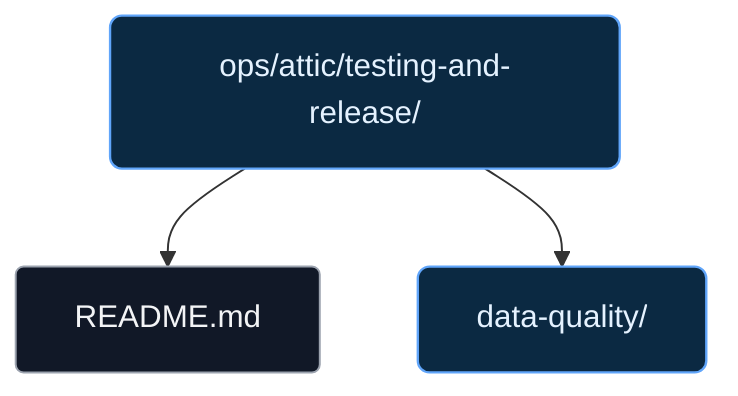

# Project Map — ops/attic/testing-and-release

```mermaid
flowchart TB
  classDef folder fill:#0b2942,stroke:#60a5fa,stroke-width:1.2,color:#e5f2ff,rx:6,ry:6
  classDef file fill:#111827,stroke:#9ca3af,stroke-width:1,color:#f3f4f6,rx:4,ry:4
  ops_attic_testing_and_release["ops/attic/testing-and-release/" ]
  class ops_attic_testing_and_release folder
  ops_attic_testing_and_release_README_md["README.md"]
  class ops_attic_testing_and_release_README_md file
  ops_attic_testing_and_release --> ops_attic_testing_and_release_README_md
  ops_attic_testing_and_release_data_quality["data-quality/"]
  class ops_attic_testing_and_release_data_quality folder
  ops_attic_testing_and_release --> ops_attic_testing_and_release_data_quality
```
