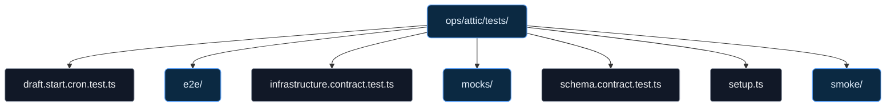

# Project Map — ops/attic/tests

```mermaid
flowchart TB
  classDef folder fill:#0b2942,stroke:#60a5fa,stroke-width:1.2,color:#e5f2ff,rx:6,ry:6
  classDef file fill:#111827,stroke:#9ca3af,stroke-width:1,color:#f3f4f6,rx:4,ry:4
  ops_attic_tests["ops/attic/tests/" ]
  class ops_attic_tests folder
  ops_attic_tests_draft_start_cron_test_ts["draft.start.cron.test.ts"]
  class ops_attic_tests_draft_start_cron_test_ts file
  ops_attic_tests --> ops_attic_tests_draft_start_cron_test_ts
  ops_attic_tests_e2e["e2e/"]
  class ops_attic_tests_e2e folder
  ops_attic_tests --> ops_attic_tests_e2e
  ops_attic_tests_infrastructure_contract_test_ts["infrastructure.contract.test.ts"]
  class ops_attic_tests_infrastructure_contract_test_ts file
  ops_attic_tests --> ops_attic_tests_infrastructure_contract_test_ts
  ops_attic_tests_mocks["mocks/"]
  class ops_attic_tests_mocks folder
  ops_attic_tests --> ops_attic_tests_mocks
  ops_attic_tests_schema_contract_test_ts["schema.contract.test.ts"]
  class ops_attic_tests_schema_contract_test_ts file
  ops_attic_tests --> ops_attic_tests_schema_contract_test_ts
  ops_attic_tests_setup_ts["setup.ts"]
  class ops_attic_tests_setup_ts file
  ops_attic_tests --> ops_attic_tests_setup_ts
  ops_attic_tests_smoke["smoke/"]
  class ops_attic_tests_smoke folder
  ops_attic_tests --> ops_attic_tests_smoke
```
