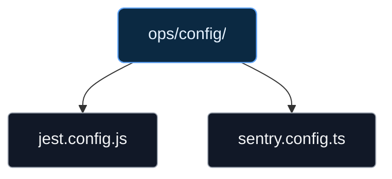

# Project Map — ops/config

```mermaid
flowchart TB
  classDef folder fill:#0b2942,stroke:#60a5fa,stroke-width:1.2,color:#e5f2ff,rx:6,ry:6
  classDef file fill:#111827,stroke:#9ca3af,stroke-width:1,color:#f3f4f6,rx:4,ry:4
  ops_config["ops/config/" ]
  class ops_config folder
  ops_config_jest_config_js["jest.config.js"]
  class ops_config_jest_config_js file
  ops_config --> ops_config_jest_config_js
  ops_config_sentry_config_ts["sentry.config.ts"]
  class ops_config_sentry_config_ts file
  ops_config --> ops_config_sentry_config_ts
```
