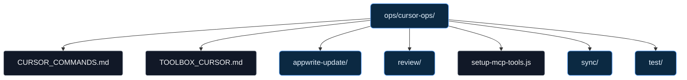

# Project Map — ops/cursor-ops

```mermaid
flowchart TB
  classDef folder fill:#0b2942,stroke:#60a5fa,stroke-width:1.2,color:#e5f2ff,rx:6,ry:6
  classDef file fill:#111827,stroke:#9ca3af,stroke-width:1,color:#f3f4f6,rx:4,ry:4
  ops_cursor_ops["ops/cursor-ops/" ]
  class ops_cursor_ops folder
  ops_cursor_ops_CURSOR_COMMANDS_md["CURSOR_COMMANDS.md"]
  class ops_cursor_ops_CURSOR_COMMANDS_md file
  ops_cursor_ops --> ops_cursor_ops_CURSOR_COMMANDS_md
  ops_cursor_ops_TOOLBOX_CURSOR_md["TOOLBOX_CURSOR.md"]
  class ops_cursor_ops_TOOLBOX_CURSOR_md file
  ops_cursor_ops --> ops_cursor_ops_TOOLBOX_CURSOR_md
  ops_cursor_ops_appwrite_update["appwrite-update/"]
  class ops_cursor_ops_appwrite_update folder
  ops_cursor_ops --> ops_cursor_ops_appwrite_update
  click ops_cursor_ops_appwrite_update "/admin/project-map/ops/cursor-ops/appwrite-update" "Open appwrite-update"
  ops_cursor_ops_review["review/"]
  class ops_cursor_ops_review folder
  ops_cursor_ops --> ops_cursor_ops_review
  click ops_cursor_ops_review "/admin/project-map/ops/cursor-ops/review" "Open review"
  ops_cursor_ops_setup_mcp_tools_js["setup-mcp-tools.js"]
  class ops_cursor_ops_setup_mcp_tools_js file
  ops_cursor_ops --> ops_cursor_ops_setup_mcp_tools_js
  ops_cursor_ops_sync["sync/"]
  class ops_cursor_ops_sync folder
  ops_cursor_ops --> ops_cursor_ops_sync
  click ops_cursor_ops_sync "/admin/project-map/ops/cursor-ops/sync" "Open sync"
  ops_cursor_ops_test["test/"]
  class ops_cursor_ops_test folder
  ops_cursor_ops --> ops_cursor_ops_test
  click ops_cursor_ops_test "/admin/project-map/ops/cursor-ops/test" "Open test"
```
