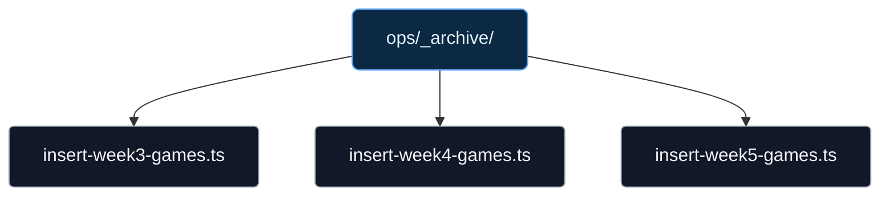

# Project Map — ops/_archive

```mermaid
flowchart TB
  classDef folder fill:#0b2942,stroke:#60a5fa,stroke-width:1.2,color:#e5f2ff,rx:6,ry:6
  classDef file fill:#111827,stroke:#9ca3af,stroke-width:1,color:#f3f4f6,rx:4,ry:4
  ops__archive["ops/_archive/" ]
  class ops__archive folder
  ops__archive_insert_week3_games_ts["insert-week3-games.ts"]
  class ops__archive_insert_week3_games_ts file
  ops__archive --> ops__archive_insert_week3_games_ts
  ops__archive_insert_week4_games_ts["insert-week4-games.ts"]
  class ops__archive_insert_week4_games_ts file
  ops__archive --> ops__archive_insert_week4_games_ts
  ops__archive_insert_week5_games_ts["insert-week5-games.ts"]
  class ops__archive_insert_week5_games_ts file
  ops__archive --> ops__archive_insert_week5_games_ts
```
