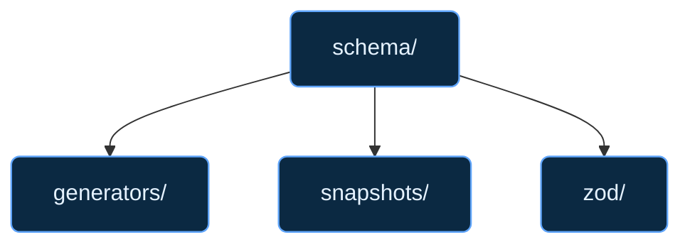

# Project Map — schema

```mermaid
flowchart TB
  classDef folder fill:#0b2942,stroke:#60a5fa,stroke-width:1.2,color:#e5f2ff,rx:6,ry:6
  classDef file fill:#111827,stroke:#9ca3af,stroke-width:1,color:#f3f4f6,rx:4,ry:4
  R["schema/"]
  class R folder
  schema_generators_["generators/"]
  class schema_generators_ folder
  R --> schema_generators_
  click schema_generators_ "/admin/project-map/schema/generators" "Open generators"
  schema_snapshots_["snapshots/"]
  class schema_snapshots_ folder
  R --> schema_snapshots_
  click schema_snapshots_ "/admin/project-map/schema/snapshots" "Open snapshots"
  schema_zod_["zod/"]
  class schema_zod_ folder
  R --> schema_zod_
  click schema_zod_ "/admin/project-map/schema/zod" "Open zod"
```
