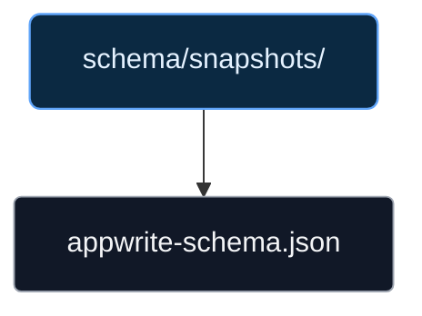

# Project Map — schema/snapshots

```mermaid
flowchart TB
  classDef folder fill:#0b2942,stroke:#60a5fa,stroke-width:1.2,color:#e5f2ff,rx:6,ry:6
  classDef file fill:#111827,stroke:#9ca3af,stroke-width:1,color:#f3f4f6,rx:4,ry:4
  schema_snapshots["schema/snapshots/" ]
  class schema_snapshots folder
  schema_snapshots_appwrite_schema_json["appwrite-schema.json"]
  class schema_snapshots_appwrite_schema_json file
  schema_snapshots --> schema_snapshots_appwrite_schema_json
```
