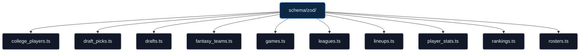

# Project Map — schema/zod

```mermaid
flowchart TB
  classDef folder fill:#0b2942,stroke:#60a5fa,stroke-width:1.2,color:#e5f2ff,rx:6,ry:6
  classDef file fill:#111827,stroke:#9ca3af,stroke-width:1,color:#f3f4f6,rx:4,ry:4
  schema_zod["schema/zod/" ]
  class schema_zod folder
  schema_zod_college_players_ts["college_players.ts"]
  class schema_zod_college_players_ts file
  schema_zod --> schema_zod_college_players_ts
  schema_zod_draft_picks_ts["draft_picks.ts"]
  class schema_zod_draft_picks_ts file
  schema_zod --> schema_zod_draft_picks_ts
  schema_zod_drafts_ts["drafts.ts"]
  class schema_zod_drafts_ts file
  schema_zod --> schema_zod_drafts_ts
  schema_zod_fantasy_teams_ts["fantasy_teams.ts"]
  class schema_zod_fantasy_teams_ts file
  schema_zod --> schema_zod_fantasy_teams_ts
  schema_zod_games_ts["games.ts"]
  class schema_zod_games_ts file
  schema_zod --> schema_zod_games_ts
  schema_zod_leagues_ts["leagues.ts"]
  class schema_zod_leagues_ts file
  schema_zod --> schema_zod_leagues_ts
  schema_zod_lineups_ts["lineups.ts"]
  class schema_zod_lineups_ts file
  schema_zod --> schema_zod_lineups_ts
  schema_zod_player_stats_ts["player_stats.ts"]
  class schema_zod_player_stats_ts file
  schema_zod --> schema_zod_player_stats_ts
  schema_zod_rankings_ts["rankings.ts"]
  class schema_zod_rankings_ts file
  schema_zod --> schema_zod_rankings_ts
  schema_zod_rosters_ts["rosters.ts"]
  class schema_zod_rosters_ts file
  schema_zod --> schema_zod_rosters_ts
```
