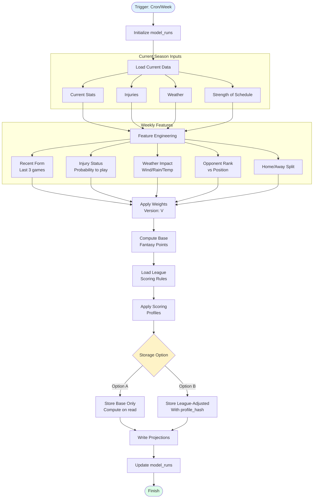
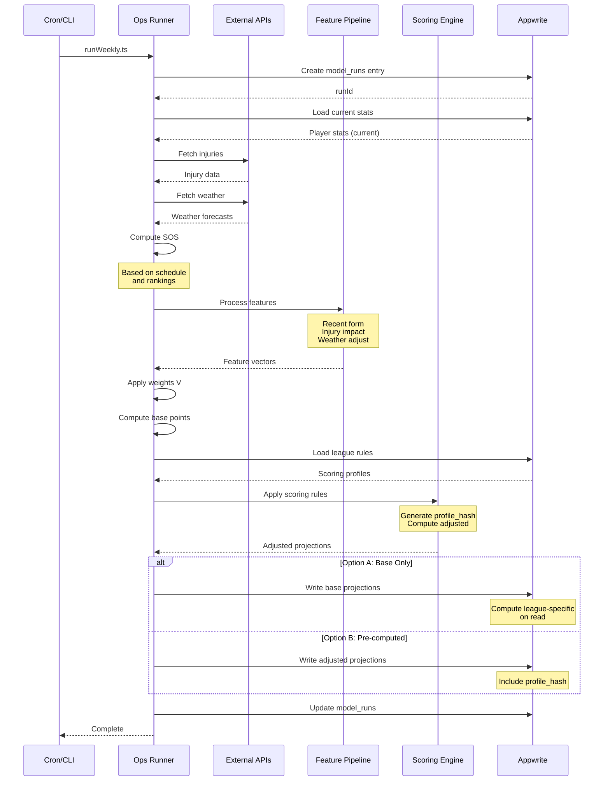

# Weekly Projections Flow (In-Season)

## Overview
Weekly projections are generated during the season with current context including injuries, weather, and strength of schedule.

## Flowchart



## Sequence Diagram



## Data Interactions

| Collection | Operation | Key Fields | Notes |
|------------|-----------|------------|-------|
| model_runs | WRITE/UPDATE | runId, week, inputsJson, metricsJson | Track weekly run |
| projections | WRITE | playerId, period='weekly', season, week, version, fantasyPoints, componentsJson | Weekly projections |
| leagues | READ | leagueId, scoringRules | Get scoring profiles |
| games | READ | week, homeTeam, awayTeam | Game context |
| player_stats | READ | playerId, season, week | Current season stats |
| rankings | READ | week, team | For SOS calculation |

## Implementation

```typescript
// ops/projections/runWeekly.ts
async function runWeeklyProjections(options: {
  version: string
  season: number
  week: number
  storageOption: 'base' | 'adjusted'
}) {
  const runId = await createModelRun({
    type: 'weekly',
    version: options.version,
    season: options.season,
    week: options.week
  })
  
  try {
    // Load current context
    const currentStats = await loadCurrentStats({
      season: options.season,
      throughWeek: options.week - 1
    })
    
    const injuries = await loadInjuries()
    const weather = await loadWeather({
      week: options.week
    })
    
    const sos = await computeSOS({
      season: options.season,
      week: options.week
    })
    
    // Feature engineering with weekly context
    const features = await engineerWeeklyFeatures({
      currentStats,
      injuries,
      weather,
      sos,
      recentGames: 3
    })
    
    // Apply weights and compute base
    const weights = await getModelWeights(options.version)
    const baseProjections = computeProjections(features, weights)
    
    // Handle scoring overlay
    if (options.storageOption === 'adjusted') {
      const leagues = await getActiveLeagues()
      const projectionRows = []
      
      for (const league of leagues) {
        const profile = getLeagueScoringProfile(league.id)
        const adjusted = applyScoring(baseProjections, profile)
        
        projectionRows.push(...adjusted.map(proj => ({
          ...proj,
          scoring_profile_hash: profile.hash,
          league_id: league.id // optional
        })))
      }
      
      await writeProjections(projectionRows)
    } else {
      // Option A: Store base only
      await writeProjections({
        projections: baseProjections,
        period: 'weekly',
        version: options.version,
        season: options.season,
        week: options.week
      })
    }
    
    await updateModelRun(runId, {
      status: 'completed',
      metrics: calculateWeeklyMetrics(baseProjections)
    })
    
  } catch (error) {
    await updateModelRun(runId, {
      status: 'failed',
      error: error.message
    })
    throw error
  }
}
```

## Weather Impact Calculation

```typescript
interface WeatherImpact {
  temperature: number // -1 to 1
  wind: number // -1 to 1  
  precipitation: number // -1 to 1
}

function calculateWeatherImpact(weather: Weather): WeatherImpact {
  return {
    // Cold weather reduces passing
    temperature: weather.temp < 32 ? -0.2 : 0,
    
    // High wind affects passing/kicking
    wind: weather.windSpeed > 20 ? -0.3 : 
          weather.windSpeed > 15 ? -0.15 : 0,
    
    // Rain/snow reduces all scoring
    precipitation: weather.precip > 0.5 ? -0.25 :
                  weather.precip > 0.2 ? -0.1 : 0
  }
}
```

## Trigger Schedule

- **Cron**: Tuesday 6 AM (after MNF, before waivers)
- **Manual**: Via admin dashboard
- **Event-driven**: On significant injury news

See also:
- docs/diagrams/project-map/overview/projections.md
- docs/diagrams/project-map/user-flow/projections-user-flow.md
