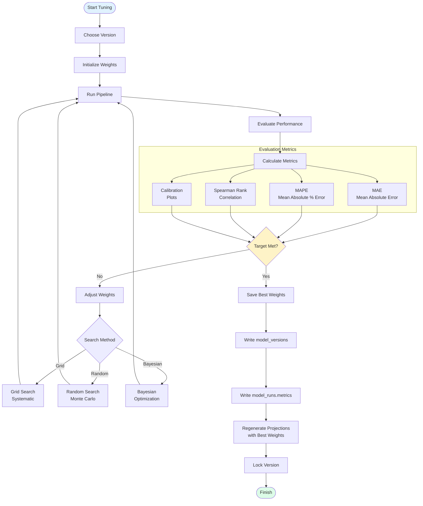
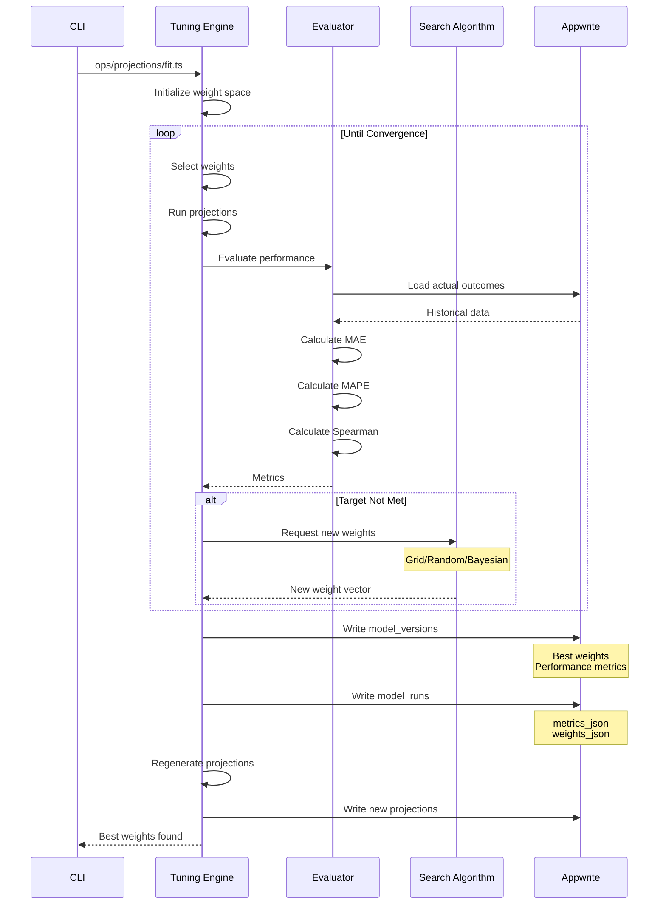

# Weight Tuning Loop

## Overview
Iterative process to optimize projection weights using historical data and performance metrics.

## Flowchart



## Sequence Diagram



## Weight Configuration

```typescript
interface WeightVector {
  // Static inputs
  depthChartWeight: number      // 0.0 - 1.0
  eaRatingWeight: number        // 0.0 - 1.0
  mockDraftWeight: number       // 0.0 - 1.0
  
  // Historical performance
  lastSeasonWeight: number      // 0.0 - 1.0
  twoSeasonsAgoWeight: number   // 0.0 - 0.5
  threeSeasonsAgoWeight: number // 0.0 - 0.3
  
  // Weekly factors
  recentFormWeight: number      // 0.0 - 1.0
  injuryWeight: number          // -1.0 - 0.0
  weatherWeight: number         // -0.5 - 0.0
  sosWeight: number             // -0.5 - 0.5
  
  // Position adjustments
  qbVolatility: number          // 0.8 - 1.2
  rbVolatility: number          // 0.7 - 1.3
  wrVolatility: number          // 0.6 - 1.4
  teVolatility: number          // 0.5 - 1.5
  kVolatility: number           // 0.9 - 1.1
}
```

## Search Strategies

### Grid Search
```typescript
function gridSearch(config: {
  paramRanges: Record<string, [min: number, max: number, step: number]>
  evaluator: (weights: WeightVector) => Promise<Metrics>
}) {
  const grid = generateGrid(config.paramRanges)
  const results = []
  
  for (const weights of grid) {
    const metrics = await config.evaluator(weights)
    results.push({ weights, metrics })
  }
  
  return results.sort((a, b) => a.metrics.mae - b.metrics.mae)[0]
}
```

### Random Search
```typescript
function randomSearch(config: {
  paramRanges: Record<string, [min: number, max: number]>
  iterations: number
  evaluator: (weights: WeightVector) => Promise<Metrics>
}) {
  const results = []
  
  for (let i = 0; i < config.iterations; i++) {
    const weights = randomSample(config.paramRanges)
    const metrics = await config.evaluator(weights)
    results.push({ weights, metrics })
  }
  
  return results.sort((a, b) => a.metrics.mae - b.metrics.mae)[0]
}
```

### Bayesian Optimization
```typescript
function bayesianOptimization(config: {
  paramRanges: Record<string, [min: number, max: number]>
  acquisitionFunction: 'ei' | 'ucb' | 'poi'
  iterations: number
  evaluator: (weights: WeightVector) => Promise<Metrics>
}) {
  const gp = new GaussianProcess()
  const observed = []
  
  // Initial random samples
  for (let i = 0; i < 5; i++) {
    const weights = randomSample(config.paramRanges)
    const metrics = await config.evaluator(weights)
    observed.push({ weights, metrics })
    gp.addObservation(weights, metrics.mae)
  }
  
  // Optimization loop
  for (let i = 0; i < config.iterations; i++) {
    const next = gp.maximize(config.acquisitionFunction)
    const metrics = await config.evaluator(next)
    gp.addObservation(next, metrics.mae)
    observed.push({ weights: next, metrics })
  }
  
  return observed.sort((a, b) => a.metrics.mae - b.metrics.mae)[0]
}
```

## Evaluation Metrics

```typescript
interface EvaluationMetrics {
  mae: number           // Mean Absolute Error
  mape: number          // Mean Absolute Percentage Error
  rmse: number          // Root Mean Square Error
  spearman: number      // Spearman Rank Correlation
  calibration: {
    bins: number[]      // Calibration plot bins
    expected: number[]  // Expected values per bin
    actual: number[]    // Actual values per bin
  }
  topNAccuracy: {
    top10: number       // % correct in top 10
    top25: number       // % correct in top 25
    top50: number       // % correct in top 50
  }
}

async function evaluate(
  predictions: Projection[],
  actuals: ActualResult[]
): Promise<EvaluationMetrics> {
  const paired = pairPredictionsWithActuals(predictions, actuals)
  
  return {
    mae: calculateMAE(paired),
    mape: calculateMAPE(paired),
    rmse: calculateRMSE(paired),
    spearman: calculateSpearmanRank(paired),
    calibration: calculateCalibration(paired),
    topNAccuracy: calculateTopNAccuracy(paired)
  }
}
```

## Target Metrics

| Metric | Excellent | Good | Acceptable |
|--------|-----------|------|------------|
| MAE | < 2.0 pts | < 3.5 pts | < 5.0 pts |
| MAPE | < 15% | < 25% | < 35% |
| Spearman | > 0.75 | > 0.65 | > 0.55 |
| Top 10 Accuracy | > 70% | > 60% | > 50% |

## CLI Implementation

```typescript
// ops/projections/fit.ts
async function fit(options: {
  method: 'grid' | 'random' | 'bayesian'
  maxIterations: number
  targetMAE: number
  validationWeeks: number[]
}) {
  console.log('Starting weight tuning...')
  
  const evaluator = async (weights: WeightVector) => {
    // Run projections with these weights
    const projections = await runProjectionsWithWeights(weights)
    
    // Load actual results for validation weeks
    const actuals = await loadActualResults(options.validationWeeks)
    
    // Calculate metrics
    return evaluate(projections, actuals)
  }
  
  let best
  switch (options.method) {
    case 'grid':
      best = await gridSearch({ evaluator, ... })
      break
    case 'random':
      best = await randomSearch({ evaluator, ... })
      break
    case 'bayesian':
      best = await bayesianOptimization({ evaluator, ... })
      break
  }
  
  // Save best weights
  await saveModelVersion({
    weights: best.weights,
    metrics: best.metrics,
    method: options.method
  })
  
  console.log('Best weights found:')
  console.log('MAE:', best.metrics.mae)
  console.log('MAPE:', best.metrics.mape)
  console.log('Spearman:', best.metrics.spearman)
}
```
