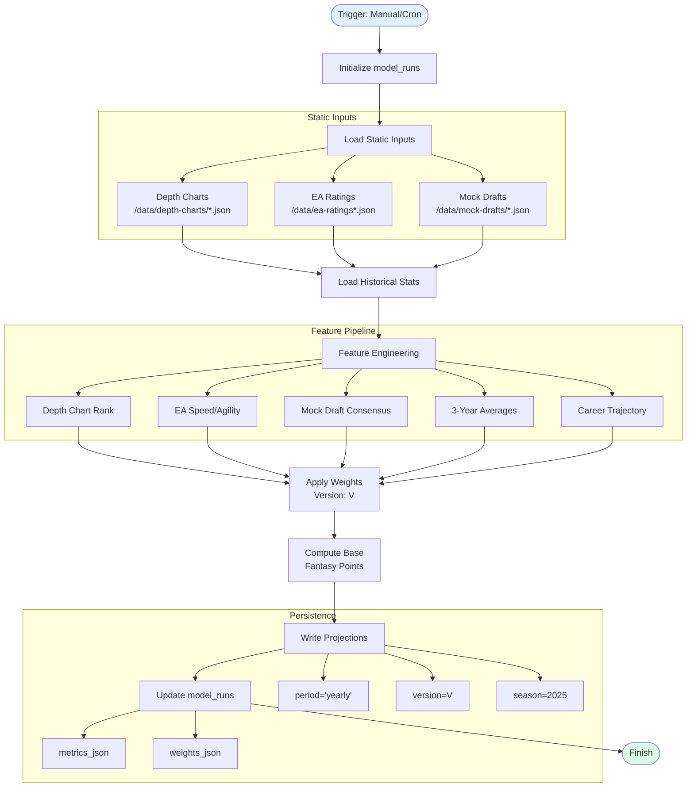
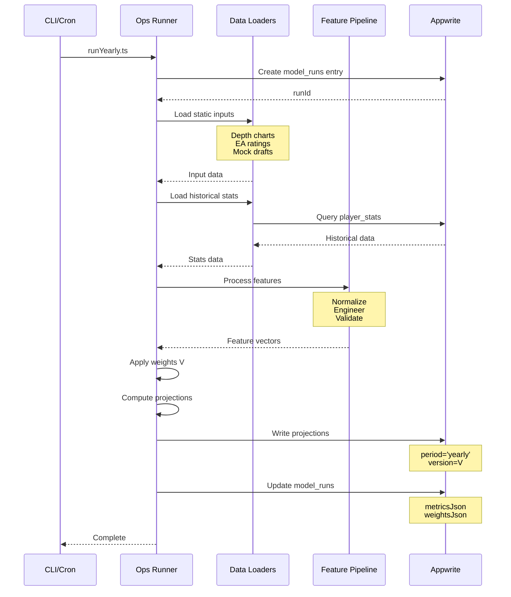

# Yearly Projections Flow (Draft)

## Overview
Yearly projections are generated for the draft process, covering the full season performance expectations.

## Flowchart



## Sequence Diagram



## Data Interactions

| Collection | Operation | Key Fields | Notes |
|------------|-----------|------------|-------|
| model_versions | READ | version, weights, status | Get active weight vector |
| model_runs | WRITE/UPDATE | runId, startedAt, inputsJson, metricsJson, weightsJson | Track run metadata |
| projections | WRITE | playerId, period='yearly', version, season, fantasyPoints, componentsJson | Store yearly projections |
| college_players | READ | playerId, name, position, team | Player base data |
| player_stats | READ | playerId, season, stats | Historical performance |

## Implementation

```typescript
// ops/projections/runYearly.ts
async function runYearlyProjections(options: {
  version: string
  season: number
  dryRun?: boolean
}) {
  // Initialize run
  const runId = await createModelRun({
    type: 'yearly',
    version: options.version,
    season: options.season
  })
  
  try {
    // Load inputs
    const depthCharts = await loadDepthCharts()
    const eaRatings = await loadEaRatings()
    const mockDrafts = await loadMockDraftsAgg()
    const historicalStats = await loadHistoricalStats({
      seasons: [season - 3, season - 2, season - 1]
    })
    
    // Feature engineering
    const features = await engineerFeatures({
      depthCharts,
      eaRatings,
      mockDrafts,
      historicalStats
    })
    
    // Load weights
    const weights = await getModelWeights(options.version)
    
    // Compute projections
    const projections = computeProjections(features, weights)
    
    // Write to database
    if (!options.dryRun) {
      await writeProjections({
        projections,
        period: 'yearly',
        version: options.version,
        season: options.season
      })
    }
    
    // Update run with metrics
    await updateModelRun(runId, {
      status: 'completed',
      metrics: calculateMetrics(projections),
      weights_json: JSON.stringify(weights)
    })
    
  } catch (error) {
    await updateModelRun(runId, {
      status: 'failed',
      error: error.message
    })
    throw error
  }
}
```

## Trigger Schedule

- **Manual**: Via admin dashboard or CLI
- **Cron**: Daily at 3 AM during August (pre-draft season)
- **On-demand**: When new depth charts or ratings available

See also:
- docs/diagrams/project-map/overview/draft.md
- docs/diagrams/project-map/data-and-entity-relation/draft-entity-relation.md
