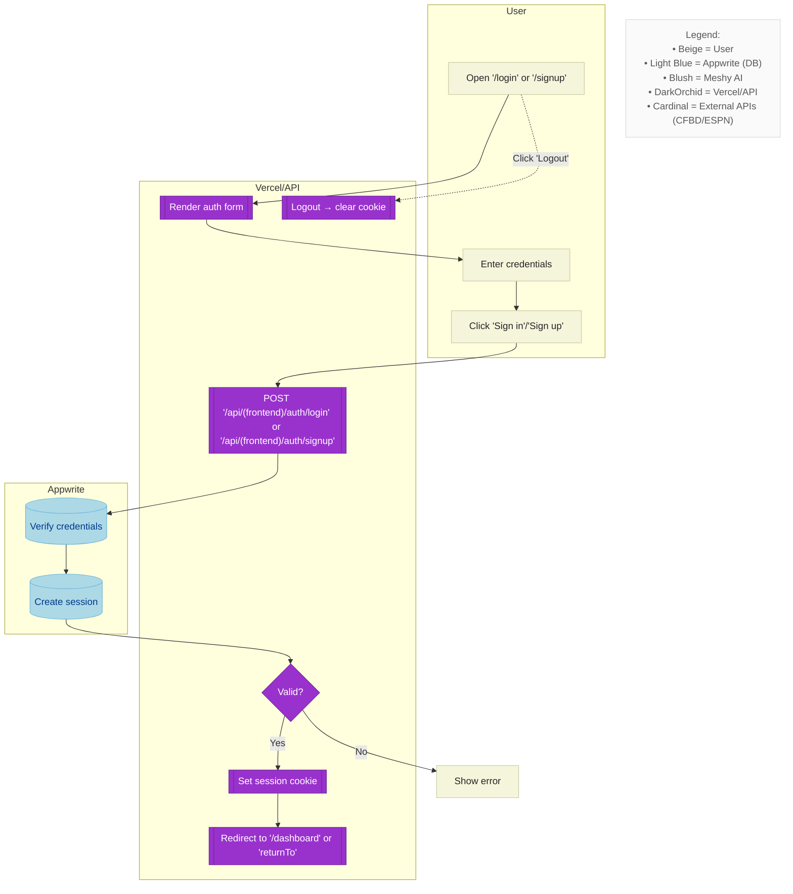

### Auth — Sign in/up

```mermaid
flowchart TD
  %% Service classes
  classDef user fill:#F5F5DC,stroke:#C9C9A3,color:#262626;
  classDef appwrite fill:#ADD8E6,stroke:#6CB6D9,color:#003A8C;
  classDef meshy fill:#DE5D83,stroke:#B34463,color:#FFFFFF;
  classDef vercel fill:#9932CC,stroke:#6E259B,color:#FFFFFF;
  classDef external fill:#C41E3A,stroke:#8E1F2E,color:#FFFFFF;
  classDef legend fill:#FAFAFA,stroke:#D9D9D9,color:#595959;

  %% Swimlanes
  subgraph "User"
    U0["Open '/login' or '/signup'"]
    U1["Enter credentials"]
    U2["Click 'Sign in'/'Sign up'"]
  end

  subgraph "Vercel/API"
    V0[["Render auth form"]]
    V1[["POST '/api/(frontend)/auth/login' or '/api/(frontend)/auth/signup'"]]
    D1{Valid?}
    V2[["Set session cookie"]]
    V3[["Redirect to '/dashboard' or 'returnTo'"]]
    V4[["Logout → clear cookie"]]
  end

  subgraph "Appwrite"
    A0[("Verify credentials")]
    A1[("Create session")]
  end

  %% Flow
  U0 --> V0 --> U1 --> U2 --> V1 --> A0 --> A1 --> D1
  D1 -- "Yes" --> V2 --> V3
  D1 -- "No" --> E1["Show error"]

  %% Logout
  U0 -. "Click 'Logout'" .-> V4

  %% Classes
  class U0,U1,U2,E1 user
  class V0,V1,V2,V3,V4,D1 vercel
  class A0,A1 appwrite

  %% Legend at end
  Legend["Legend:\n• Beige = User\n• Light Blue = Appwrite (DB)\n• Blush = Meshy AI\n• DarkOrchid = Vercel/API\n• Cardinal = External APIs (CFBD/ESPN)"]:::legend
```

#### Legend

- Terminator: rounded (Start/End)
- Decision: diamond
- Process: rectangle
- Swimlanes: User | App (Next.js) | Appwrite
- Async steps are dashed when shown
