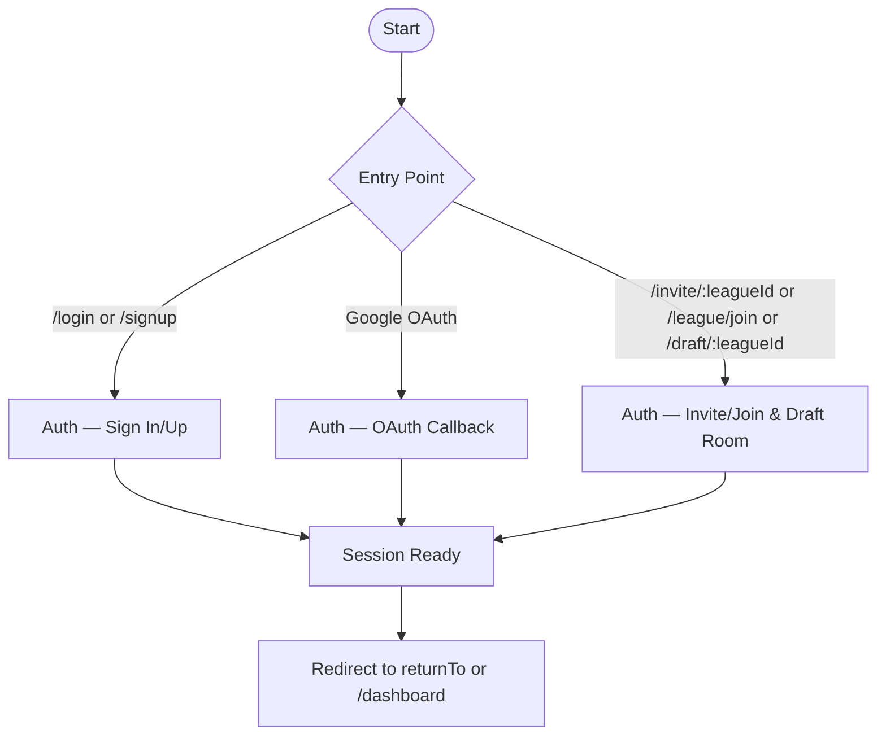
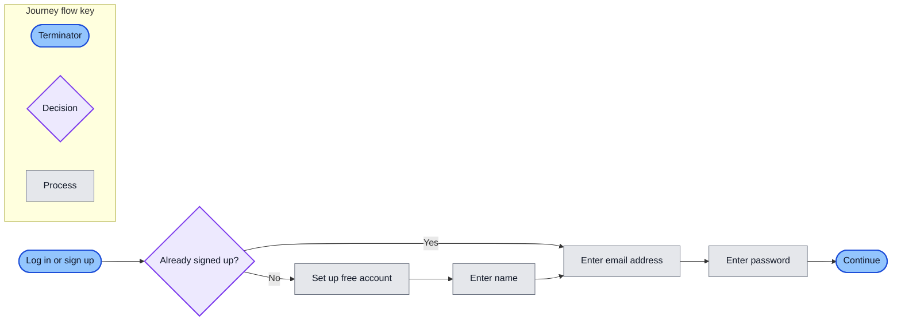

# Auth User Flow

High‑level guide to how users enter authentication flows from UI buttons and where they land. Detailed flows are split into focused diagrams for readability and troubleshooting.

## Buttons → Flows

| Button               | Route              | Flow Diagram                                    |
| -------------------- | ------------------ | ----------------------------------------------- |
| Login                | /login             | `user-journeys:auth:sign-in-up`                 |
| Sign up              | /signup            | `user-journeys:auth:sign-in-up`                 |
| Continue with Google | /login → OAuth     | `user-journeys:auth:oauth-callback`             |
| Invite link          | /invite/[leagueId] | `user-journeys:auth:invite-join-and-draft-room` |
| Join League          | /league/join       | `user-journeys:auth:invite-join-and-draft-room` |
| DRAFT ROOM           | /draft/[leagueId]  | `user-journeys:auth:invite-join-and-draft-room` |
| Admin                | /admin             | `user-journeys:auth:sign-in-up` (guarded)       |

## Guards & Redirects (authoritative)

- Protected routes redirect to `/login?returnTo=…` when no session.
- OAuth callback establishes session, then redirects to `returnTo` or `/dashboard`.
- Admin access: allowlist (e.g., `kashpm2002@gmail.com`).
- Draft Room: visible 1h before → active → hidden 3h after; commissioner override.

## Map of sub‑flows

## Notes

- Diagrams use swimlanes for User | App (Next.js) | Appwrite | External.
- Edge labels are verbs; dashed lines indicate async operations.
- Keep diagrams ≤ ~80 nodes and readable on one screen.

1. Visit login → choose provider (email, Google)
2. Authenticate → Appwrite session cookie set
3. Redirect to dashboard or intended page
4. Session refresh on navigation; logout clears session

Related: ../overview/auth.md

