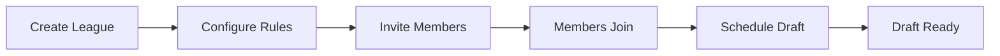

# Leagues User Flow

Commissioner:
- Create league → configure rules → invite members → schedule draft

Member:
- Discover/join league → create team → view dashboard

Post-creation:
- Manage settings (non-immutable only) → monitor join status → draft readiness

Related: ../overview/leagues.md

