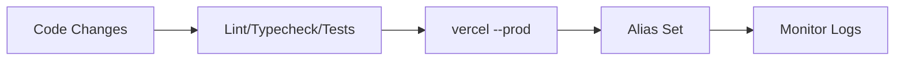

# Ops/Deploy User Flow

Flow:
- Dev changes → lint/typecheck/tests → vercel --prod → alias set
- Monitor logs → rollback if needed

Related: ../overview/ops-deploy.md

```mermaid
flowchart LR
  C[Code Changes] --> L[Lint/Typecheck/Tests]
  L --> D[vercel --prod]
  D --> A[Alias Set]
  A --> M[Monitor Logs]
```

