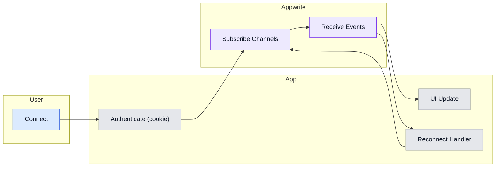

# Realtime User Flow

Connection lifecycle:

- Connect → authenticate via cookie → subscribe to channels
- Receive updates → UI refresh → handle reconnects

Related: ../overview/realtime.md

```mermaid
flowchart LR
  subgraph User
    C["Connect"]
  end
  subgraph App
    A["Authenticate (cookie)"]
    U["UI Update"]
    R["Reconnect Handler"]
  end
  subgraph Appwrite
    S["Subscribe Channels"]
    E["Receive Events"]
  end

  C --> A --> S --> E --> U
  E --> R --> S

  %% Lane colors (match UI legend)
  classDef laneUser fill:#DBEAFE,stroke:#1D4ED8,color:#0B1020
  classDef laneApp fill:#E5E7EB,stroke:#6B7280,color:#111827
  classDef laneAppwrite fill:#EDE9FE,stroke:#7C3AED,color:#111827
  class C laneUser
  class A,U,R laneApp
  class S,E laneAppwrite
```
