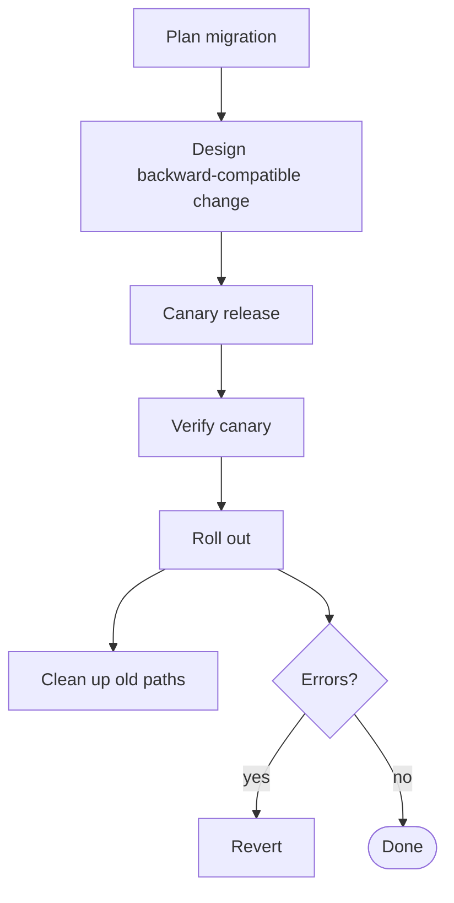

### Workflow — Change the Database Safely (Backward‑compat + Canary)

```mermaid
flowchart TD
  PLAN[Plan migration] --> DESIGN[Design backward‑compatible change]
  DESIGN --> CANARY[Canary release]
  CANARY --> VERIFY[Verify canary]
  VERIFY --> ROLLALL[Roll out]
  ROLLALL --> CLEANUP[Clean up old paths]
  ROLLALL --> ROLLBACK{Errors?}
  ROLLBACK -- yes --> REVERT[Revert]
  ROLLBACK -- no --> DONE([Done])
```
