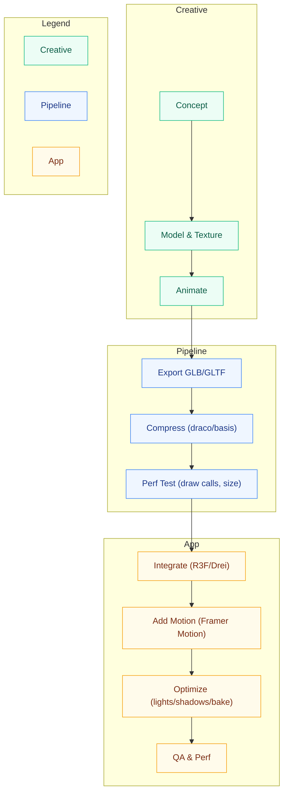

### Workflow — Design 3D & Animations

```mermaid
flowchart TD
  subgraph Creative
    C1["Concept"]
    C2["Model & Texture"]
    C3["Animate"]
  end
  subgraph Pipeline
    P1["Export GLB/GLTF"]
    P2["Compress (draco/basis)"]
    P3["Perf Test (draw calls, size)"]
  end
  subgraph App
    A1["Integrate (R3F/Drei)"]
    A2["Add Motion (Framer Motion)"]
    A3["Optimize (lights/shadows/bake)"]
    A4["QA & Perf"]
  end

  C1 --> C2 --> C3 --> P1 --> P2 --> P3 --> A1 --> A2 --> A3 --> A4

  %% Lane colors
  classDef laneCreative fill:#ECFDF5,stroke:#10B981,color:#065F46
  classDef lanePipeline fill:#EFF6FF,stroke:#3B82F6,color:#1E3A8A
  classDef laneApp fill:#FFFBEB,stroke:#F59E0B,color:#7C2D12

  class C1,C2,C3 laneCreative
  class P1,P2,P3 lanePipeline
  class A1,A2,A3,A4 laneApp

  %% Legend
  subgraph Legend
    L1[Creative]:::laneCreative
    L2[Pipeline]:::lanePipeline
    L3[App]:::laneApp
  end
```
