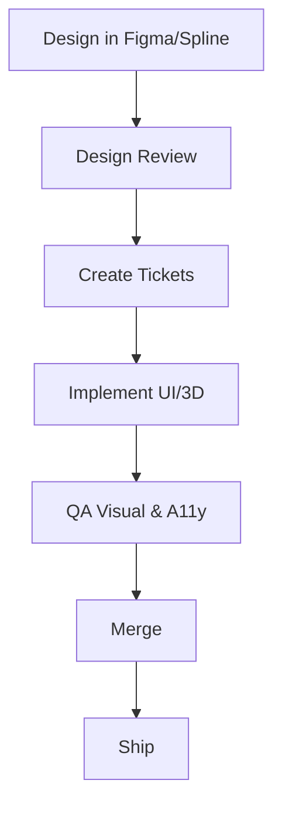

### Workflow — Design to Code (Handoff → Integration)

```mermaid
flowchart TD
  DESIGN[Design in Figma/Spline] --> REVIEW[Design Review]
  REVIEW --> TICKETS[Create Tickets]
  TICKETS --> DEV[Implement UI/3D]
  DEV --> QA[QA Visual & A11y]
  QA --> MERGE[Merge]
  MERGE --> SHIP[Ship]
```
