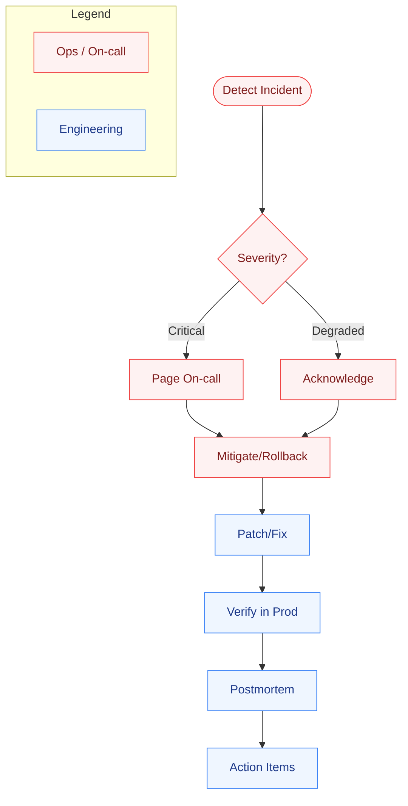

### Workflow — Fix a Production Incident

```mermaid
flowchart TD
  DETECT([Detect Incident]) --> TRIAGE{Severity?}
  TRIAGE -- Critical --> PAGE[Page On‑call]
  TRIAGE -- Degraded --> ACK[Acknowledge]
  PAGE --> MITIGATE[Mitigate/Rollback]
  ACK --> MITIGATE
  MITIGATE --> FIX[Patch/Fix]
  FIX --> VERIFY[Verify in Prod]
  VERIFY --> POST[Postmortem]
  POST --> IMPROVE[Action Items]

  %% Lane colors (Ops vs Eng)
  classDef laneOps fill:#FEF2F2,stroke:#EF4444,color:#7F1D1D
  classDef laneEng fill:#EFF6FF,stroke:#3B82F6,color:#1E3A8A
  class DETECT,TRIAGE,PAGE,ACK,MITIGATE laneOps
  class FIX,VERIFY,POST,IMPROVE laneEng

  %% Legend
  subgraph Legend
    L1[Ops / On‑call]:::laneOps
    L2[Engineering]:::laneEng
  end
```
