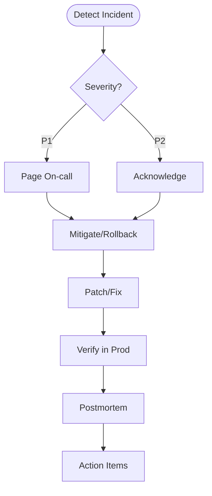

### Workflow — Incident / Hotfix Response (P1/P2)

```mermaid
flowchart TD
  DETECT([Detect Incident]) --> TRIAGE{Severity?}
  TRIAGE -- P1 --> PAGE[Page On‑call]
  TRIAGE -- P2 --> ACK[Acknowledge]
  PAGE --> MITIGATE[Mitigate/Rollback]
  ACK --> MITIGATE
  MITIGATE --> FIX[Patch/Fix]
  FIX --> VERIFY[Verify in Prod]
  VERIFY --> POST[Postmortem]
  POST --> IMPROVE[Action Items]
```
