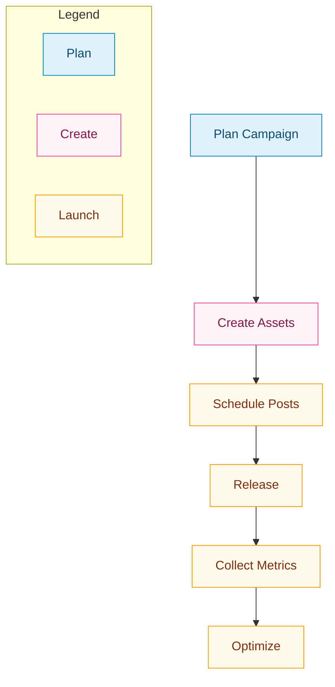

### Workflow — Launch a Campaign (Content Pipeline)

```mermaid
flowchart TD
  PLAN[Plan Campaign] --> ASSETS[Create Assets]
  ASSETS --> SCHEDULE[Schedule Posts]
  SCHEDULE --> RELEASE[Release]
  RELEASE --> METRICS[Collect Metrics]
  METRICS --> OPTIMIZE[Optimize]

  %% Lane colors (Plan/Create/Launch)
  classDef lanePlan fill:#E0F2FE,stroke:#0284C7,color:#0C4A6E
  classDef laneCreate fill:#FDF2F8,stroke:#EC4899,color:#831843
  classDef laneLaunch fill:#FFFBEB,stroke:#F59E0B,color:#7C2D12

  class PLAN lanePlan
  class ASSETS laneCreate
  class SCHEDULE,RELEASE,METRICS,OPTIMIZE laneLaunch

  %% Legend
  subgraph Legend
    L1[Plan]:::lanePlan
    L2[Create]:::laneCreate
    L3[Launch]:::laneLaunch
  end
```
