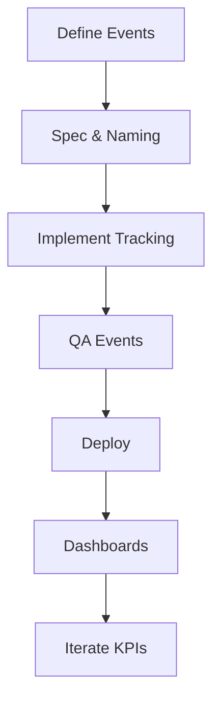

### Workflow — Track Events Correctly

```mermaid
flowchart TD
  DEFINE[Define Events] --> SPEC[Spec & Naming]
  SPEC --> INSTR[Implement Tracking]
  INSTR --> QA[QA Events]
  QA --> DEPLOY[Deploy]
  DEPLOY --> DASH[Dashboards]
  DASH --> ITERATE[Iterate KPIs]
```
