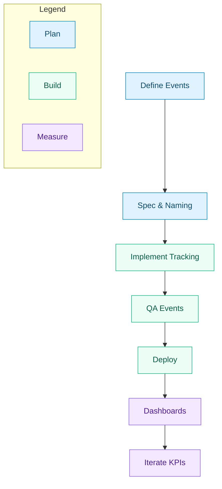

### Workflow — Track Events Correctly

```mermaid
flowchart TD
  DEFINE[Define Events] --> SPEC[Spec & Naming]
  SPEC --> INSTR[Implement Tracking]
  INSTR --> QA[QA Events]
  QA --> DEPLOY[Deploy]
  DEPLOY --> DASH[Dashboards]
  DASH --> ITERATE[Iterate KPIs]

  %% Lane colors (Plan/Build/Measure)
  classDef lanePlan fill:#E0F2FE,stroke:#0284C7,color:#0C4A6E
  classDef laneBuild fill:#ECFDF5,stroke:#10B981,color:#065F46
  classDef laneMeasure fill:#F3E8FF,stroke:#8B5CF6,color:#4C1D95

  class DEFINE,SPEC lanePlan
  class INSTR,QA,DEPLOY laneBuild
  class DASH,ITERATE laneMeasure

  %% Legend
  subgraph Legend
    L1[Plan]:::lanePlan
    L2[Build]:::laneBuild
    L3[Measure]:::laneMeasure
  end
```
