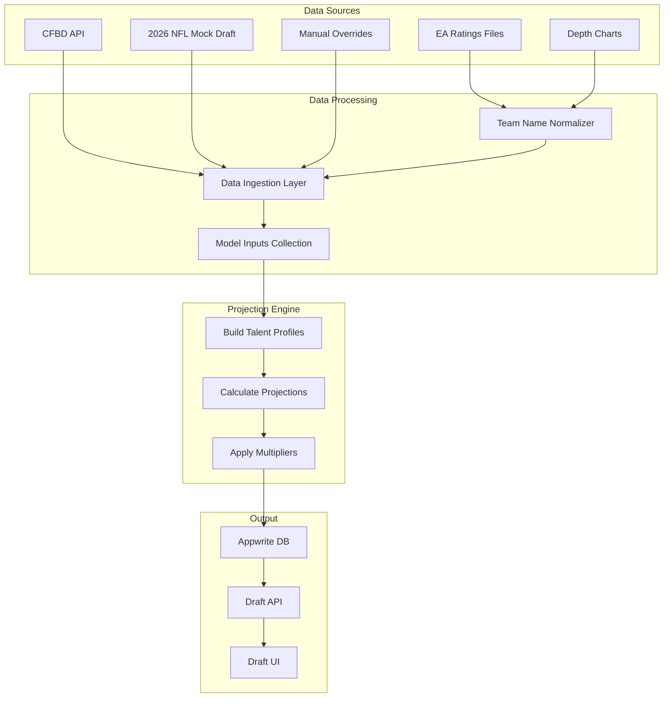
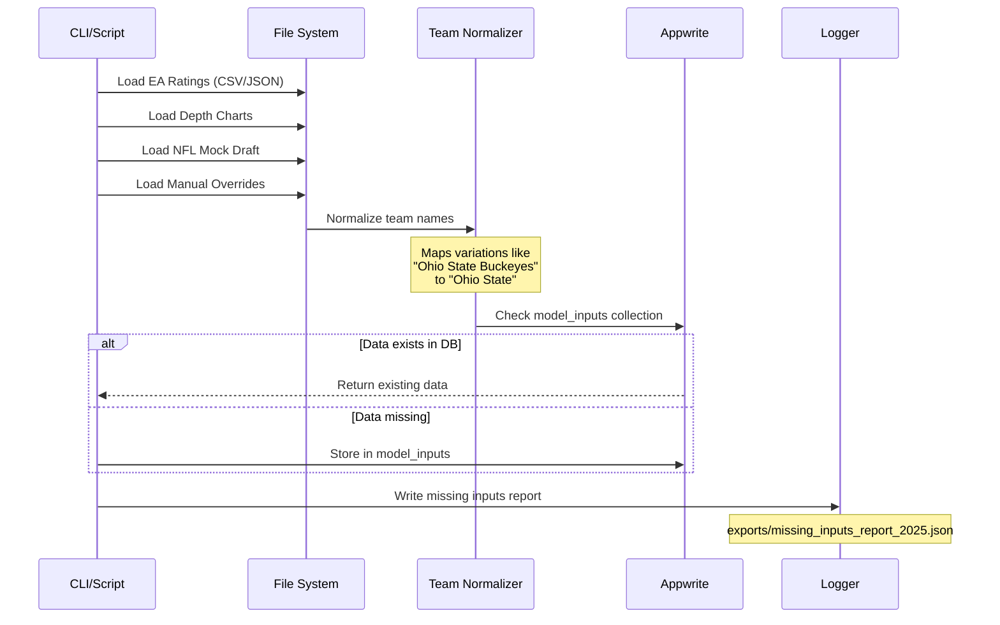
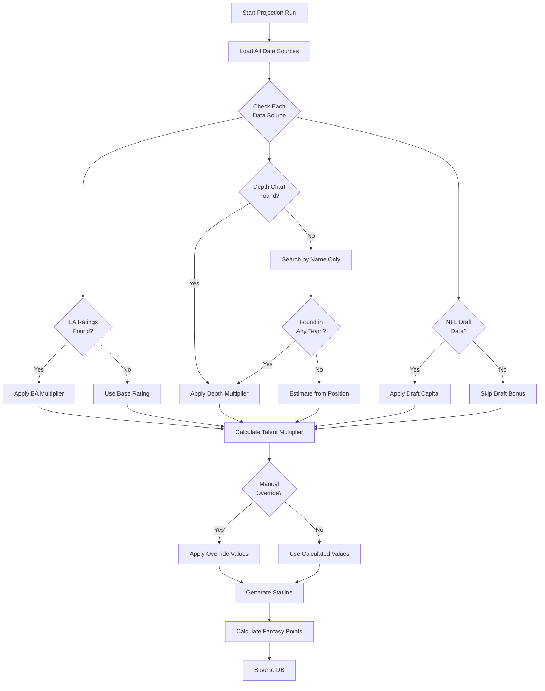
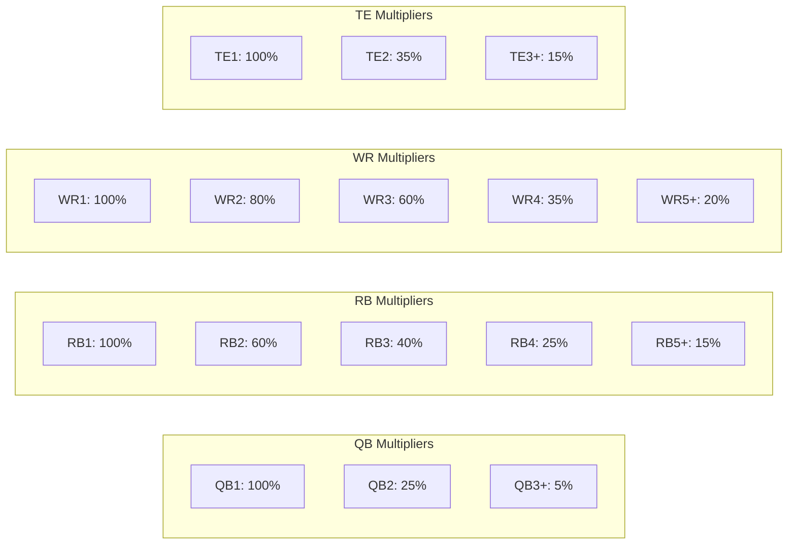
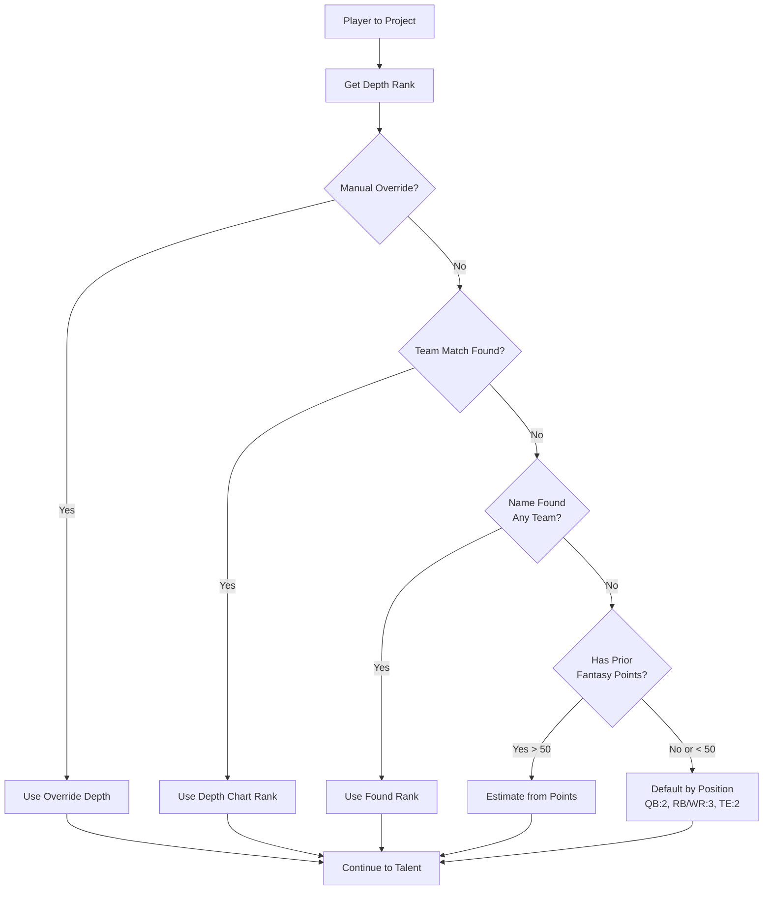
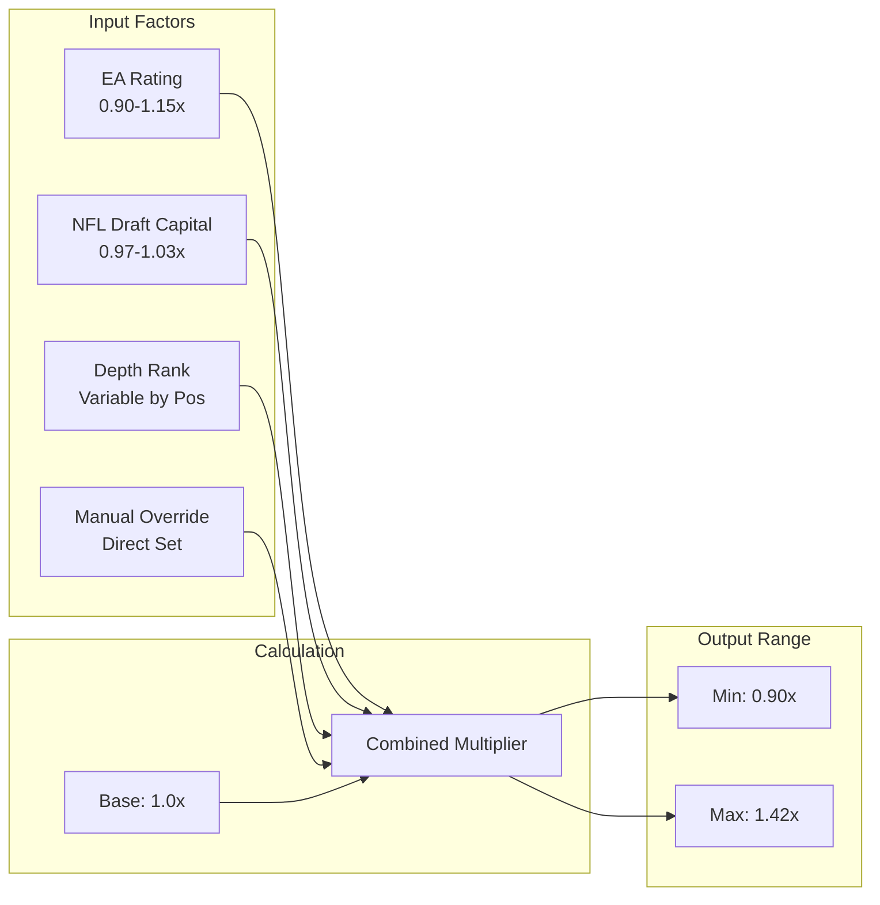
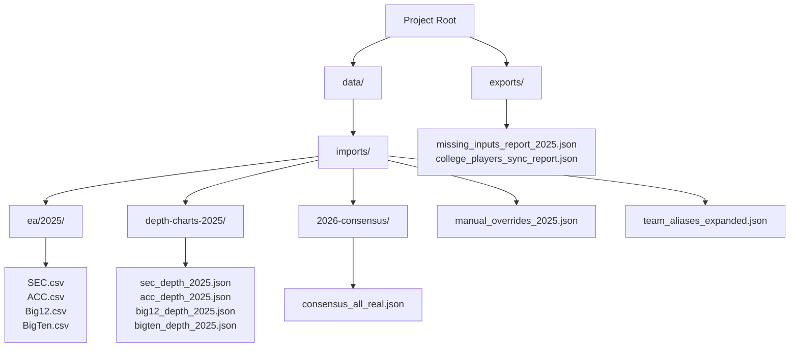
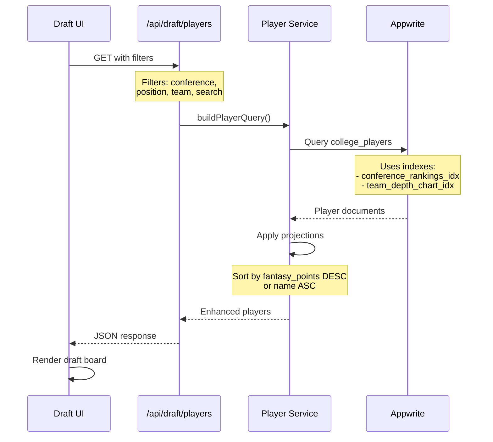
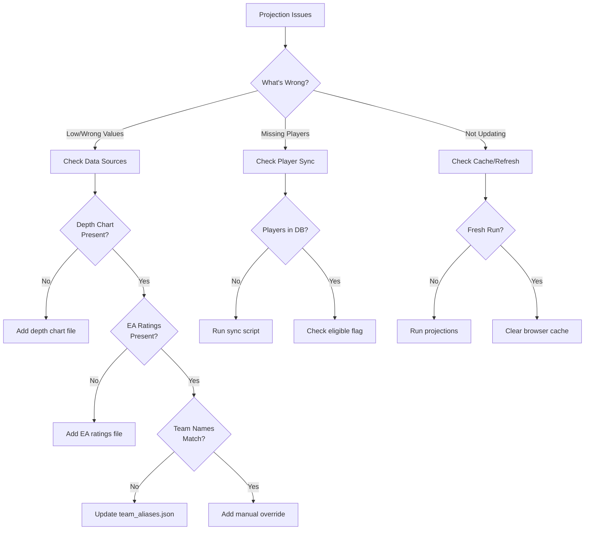

# CFB Fantasy — Updated Projections System (January 2025)

## System Overview



## Data Ingestion Pipeline



## Enhanced Projection Algorithm



## Depth Chart Multiplier Logic



## Data Source Priority & Fallback



## Talent Multiplier Calculation



## File Organization Structure



## API Query Flow



## Troubleshooting Decision Tree



## Key Improvements (January 2025)

### 1. Data Source Integration
- ✅ Unified EA ratings format (one CSV per conference)
- ✅ Standardized depth chart JSON structure
- ✅ 2026 NFL mock draft consensus integration
- ✅ Manual override system for fine-tuning

### 2. Fallback Mechanisms
- ✅ Team name normalization with aliases
- ✅ Depth rank fallback: team → name-only → position default
- ✅ EA ratings fallback: exact → normalized → skip
- ✅ Progressive data loading: DB → files → defaults

### 3. Projection Accuracy
- ✅ Position-specific depth multipliers
- ✅ Talent multiplier range: 0.90x - 1.42x
- ✅ Realistic point ranges:
  - QBs: 230-255 pts
  - RBs: 290-330 pts
  - WRs: 220-240 pts
  - TEs: 140-180 pts

### 4. Performance Optimizations
- ✅ Batch processing (3 teams at a time)
- ✅ Pagination for large queries
- ✅ Indexed database queries
- ✅ Cached model inputs

## Running Projections

```bash
# Run for all Power 4
npx tsx functions/unified-talent-projections/index.ts --season=2025

# Run for specific conference
npx tsx functions/unified-talent-projections/index.ts --season=2025 --conference='SEC'

# Run for specific teams
npx tsx functions/unified-talent-projections/index.ts --season=2025 --teams='Alabama,Georgia,LSU'

# Check specific player
npx tsx ops/common/scripts/check-player-projections.ts --name='Sam Leavitt'
```

## Data File Locations

| Data Type | Location | Format |
|-----------|----------|--------|
| EA Ratings | `data/imports/ea/2025/*.csv` | CSV with columns: Name, Team, Position, Overall, Speed, etc. |
| Depth Charts | `data/imports/depth-charts-2025/*_depth_2025.json` | JSON with team/position structure |
| NFL Consensus | `data/imports/2026-consensus/consensus_all_real.json` | JSON with player rankings |
| Manual Overrides | `data/imports/manual_overrides_2025.json` | JSON with player-specific adjustments |
| Team Aliases | `data/team_aliases_expanded.json` | JSON mapping team name variations |

---

*Last Updated: January 2025*