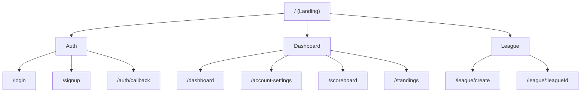

## Purpose
Concise, actionable rules for creating repository site maps that are readable, consistent, and code‑reflective. Based on the Drive guide [Section 1](https://drive.google.com/drive/folders/10FsLx1yEHSZrEJdum_jdU3ukQvEAX21G?usp=sharing).

## Visual style (top‑down inverted tree)
- Root at the top: `"/ (Landing)"`.
- Use Mermaid `graph TD` with left‑aligned labels.
- Max depth per sheet: 3; split busy branches into sub‑maps.
- Clusters (optional): Auth, Dashboard, League, Draft, Admin, Public Content.
- Line semantics: solid for parent→child; dotted for redirects/aliases (rare).

## Labeling
- Route nodes show path (use `:param` notation for dynamics).
- Add small inline notes only when critical (e.g., `time‑gated`, `role: commissioner`).
- Avoid prose in nodes; keep to short labels.

## Content rules
- Include only currently implemented routes for the “Active” map.
- For “Final” map, suffix planned nodes with `(planned)`.
- Group admin tools and diagram hubs to reduce clutter.
- Reflect Next.js App Router reality: generate baseline via `ops/diagrams/generate-sitemap-from-routes.ts`, then manually add minimal grouping nodes.

## Authoring steps
1) Run code sync: `npm run diagrams:sitemap` (or execute the script directly).
2) Paste the generated Mermaid block into `docs/diagrams/site map/sitemap-web-active.md`.
3) Add cluster headings and critical annotations.
4) For mobile, mirror structure with Tabs section.
5) Add legend (depth, planned, gates, grouping).

## Mermaid template (starter)

## QA checklist
- [ ] Root at top, depth ≤ 3
- [ ] All paths exist (active) or are tagged (final)
- [ ] Critical gates annotated
- [ ] No long labels; consistent casing
- [ ] Diagram renders in Admin with zoom controls
