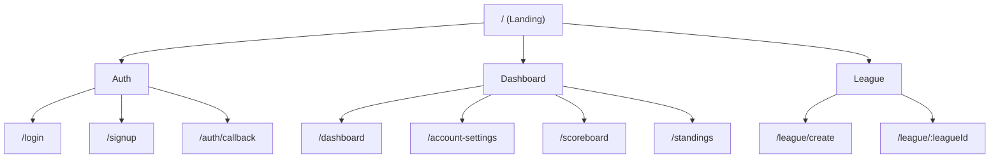

## Purpose

Concise, actionable rules for creating repository site maps that are readable, consistent, and code‑reflective. Based on the Drive guide [Section 1](https://drive.google.com/drive/folders/10FsLx1yEHSZrEJdum_jdU3ukQvEAX21G?usp=sharing).

## Visual style (top‑down inverted tree)

- Root at the top: `"/ (Landing)"`.
- Prefer Mermaid `mindmap` for compact hierarchical site maps. Use `graph TD` only when you need explicit edges or annotations not supported by `mindmap`.
- Max depth per sheet: 3; split busy branches into sub‑maps.
- Optional grouping branches: Auth, Dashboard, League, Draft, Admin, Public Content.
- Line semantics (for `graph TD` only): solid for parent→child; dotted for redirects/aliases (rare).

## Labeling

- Route nodes show path (use `:param` notation for dynamics, e.g., `/league/:leagueId`).
- Add small inline notes only when critical (e.g., `time‑gated`, `role: commissioner`).
- Avoid prose in nodes; keep to short labels.
- In `mindmap`, avoid quoting labels. Use plain text when possible, e.g., `My Teams (planned)` not `"My Teams (planned)"`.

## Content rules

- Include only currently implemented routes for the “Active” map.
- For “Final” map, suffix planned nodes with `(planned)`.
- Group admin tools and diagram hubs to reduce clutter.
- Reflect Next.js App Router reality: generate baseline via `ops/diagrams/generate-sitemap-from-routes.ts`, then manually add minimal grouping nodes.

## Parser‑safe Mermaid conventions

- `mindmap` does not support subgraphs; represent groupings as top‑level branches under the root.
- Avoid square‑bracket subgraph titles and shape variants; `mindmap` only needs plain lines with indentation.
- Do not include trailing slashes in route labels.
- Prefer `:param` over `[param]` in labels.

## Authoring steps

1. Generate baseline: `npm run diagrams:sitemap` (or run `tsx ops/diagrams/generate-sitemap-from-routes.ts`).
2. Paste the generated Mermaid block into `docs/diagrams/site map/sitemap-web-active.md`.
3. Convert to `mindmap` if needed and add grouping branches (Auth, Dashboard, League, Draft, Admin, Public Content).
4. For mobile, mirror structure and add a `Tabs` section (Home/Leagues/Activity/Profile).
5. Add legend (depth, planned, gates, grouping).

## Render & audit

- Preview: `/admin/diagrams/sitemap:web:active`, `:final`, `:mobile:active`, `:mobile:final`.
- Live audit (production):
  - `BASE_URL=https://<deploy-url> npx tsx ops/common/scripts/audit-diagrams-live.ts`
- Ensure 0 failures in `e2e-admin-diagrams-live-audit.json` before merging.

## Mermaid template (starter)

### Citation

- Drive PDS: [Diagram Guides Folder](https://drive.google.com/drive/folders/10FsLx1yEHSZrEJdum_jdU3ukQvEAX21G?usp=sharing)
- Site Map PDS: [Section 1 PDF](https://drive.google.com/file/d/1SJHgcZrBx_ktqRObAhWe8YJMsUy-xMWr/view?usp=sharing)

## QA checklist

- [ ] Root at top, depth ≤ 3
- [ ] All paths exist (active) or are tagged (final)
- [ ] Critical gates annotated
- [ ] No long labels; consistent casing
- [ ] Diagram renders in Admin with zoom controls
