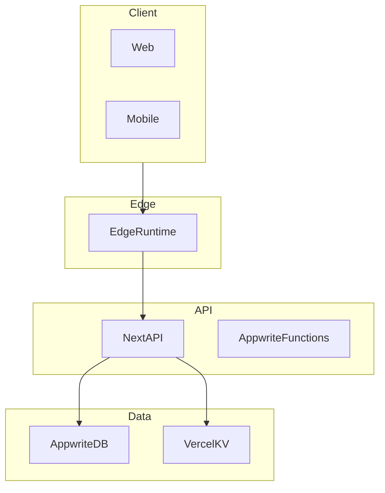

## Purpose
Depict major components, data stores, externals, and runtime boundaries with performance and integration notes.

## Visual style
- Use Mermaid `flowchart TD` with clusters for: Client Apps, Edge (Vercel Edge), API (Next API/Appwrite), Data (Appwrite collections, KV), External Providers (CFBD, ESPN, Lucid, Runway).
- Edges show request/response; label with protocol or key event (HTTP, WebSocket, Cron).
- Annotate latency/TTL where applicable.

## Content rules
- Include only active components for the “current” diagram; clearly tag planned components.
- Note runtimes (EDGE/NODE) and deployment surfaces (Vercel, Appwrite Functions).
- Show core data paths for key flows (auth, draft, scoring, projections) but keep high‑level.

## Authoring steps
1) List components and group into clusters.
2) Draw main request paths and data flows.
3) Add latency/TTL notes (e.g., KV TTLs, expected response times).
4) Add error/retry/monitoring notes sparingly.

## Mermaid starter

## QA checklist
- [ ] Clear cluster separations
- [ ] Runtimes and externals labeled
- [ ] Only essential flows
