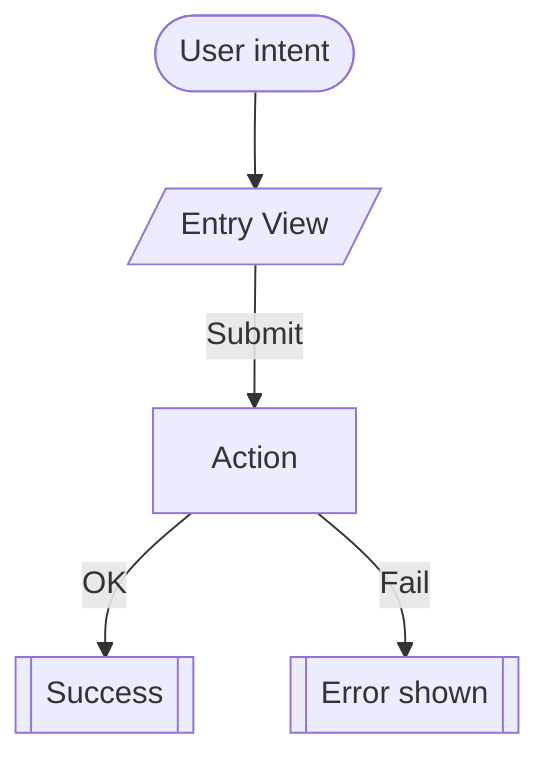

## Purpose
Standardize flow diagrams for key experiences (sign‑in/up, invite & join, draft, leagues) so they are easy to scan and maintain.

## Visual style
- Use Mermaid `flowchart TD` for linear flows; `sequenceDiagram` for conversational exchanges.
- Node types:
  - Action (rounded rect), Decision (diamond), Page/View (rect), External Service (hexagon), Note (callout).
- Keep one clear goal per diagram; split variants into sub‑diagrams.

## Content rules
- Start with trigger and entry state; end with success and error resolutions.
- Pair each step with the page/route or API that executes it (small annotation).
- Show auth/session checks explicitly where flow diverges.
- Limit cross‑branch connectors; prefer local steps.

## Authoring steps
1) Identify the happy path; add error branches second.
2) Annotate calls to `/api/...` and Appwrite collections where relevant.
3) Use short verbs for actions and concrete page names for views.
4) Add a compact legend.

## Mermaid template

## QA checklist
- [ ] One user goal per sheet
- [ ] All decisions have both outcomes
- [ ] Steps map to real routes/APIs
- [ ] Error handling clear
