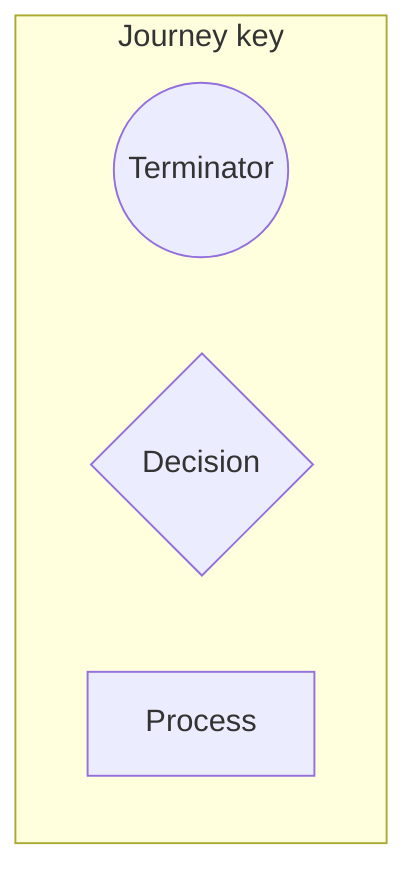

## Purpose
Standardize flow diagrams for key experiences (sign‑in/up, invite & join, draft, leagues) so they are easy to scan and maintain.

## Visual style
- Use Mermaid `flowchart TD` for linear flows; `sequenceDiagram` for conversational exchanges.
- Node types:
  - Action (rounded rect), Decision (diamond), Page/View (rect), External Service (hexagon), Note (callout).
- Keep one clear goal per diagram; split variants into sub‑diagrams.

## Content rules
- Start with trigger and entry state; end with success and error resolutions.
- Pair each step with the page/route or API that executes it (small annotation).
- Show auth/session checks explicitly where flow diverges.
- Limit cross‑branch connectors; prefer local steps.

## Authoring steps
1) Identify the happy path; add error branches second.
2) Annotate calls to `/api/...` and Appwrite collections where relevant.
3) Use short verbs for actions and concrete page names for views.
4) Add a compact legend.

## Mermaid template

## QA checklist
- [ ] One user goal per sheet
- [ ] All decisions have both outcomes
- [ ] Steps map to real routes/APIs
- [ ] Error handling clear

## Parser‑safe Mermaid conventions
- Use simple lane titles: `User`, `App`, `Appwrite`, `Google`, `External`.
- Avoid bracketed subgraph titles (e.g., `subgraph A[App (Next.js)]`); use `subgraph App` instead.
- Prefer plain rectangle `[Label]`; avoid special shape variants like `[/ ... /]` that conflict with slashes.
- Quote labels that contain slashes or parentheses, e.g., `A0["GET /auth/callback"]`.
- Replace `[param]` with `:param` in labels.
- Start nodes with `((Start))` or `([Start])` consistently across diagrams.

## Legend snippet (optional)

## Render & audit
- Preview via Admin: `/admin/diagrams/user-journeys:auth:sign-in-up` (and peers)
- Live audit on production:
  - `BASE_URL=https://<deploy-url> npx tsx ops/common/scripts/audit-diagrams-live.ts`
- Target 0 failures in `e2e-admin-diagrams-live-audit.json` before merge.

### Citation
- Drive PDS: [Diagram Guides Folder](https://drive.google.com/drive/folders/10FsLx1yEHSZrEJdum_jdU3ukQvEAX21G?usp=sharing)
- User Journeys PDS: [Section 2 PDF](https://drive.google.com/file/d/1YBpHGnqKuBWjIA19SWEIRDGP7WrH407j/view?usp=sharing)
