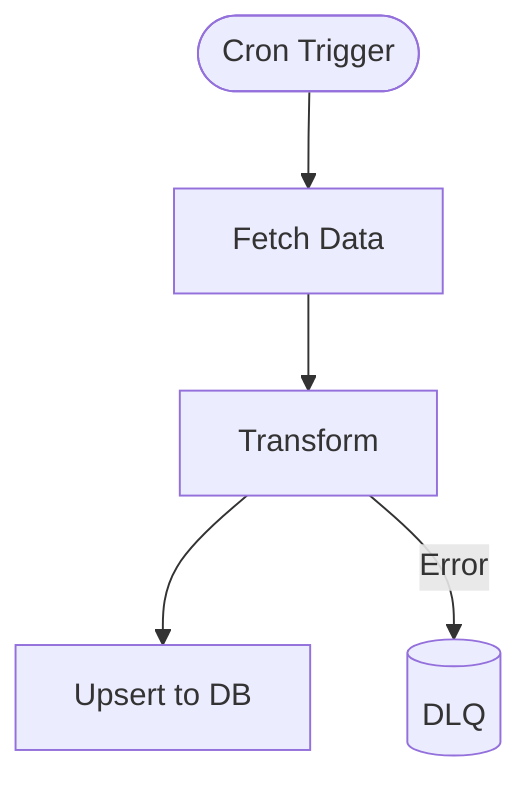

## Purpose
Define async/background processes (cron jobs, ETL, queues) with clear triggers, steps, and observability.

## Visual style
- Use Mermaid `flowchart TD` or `sequenceDiagram` when interactions are time‑ordered.
- Show triggers (cron, webhook), workers (Appwrite Functions, workers/), queues, and data sinks (Appwrite, KV, Storage) with labeled edges.

## Content rules
- One workflow per diagram; include retry/backoff and failure sinks.
- Indicate schedule (cron) or event source; show idempotency keys when relevant.
- Add monitoring hooks (Sentry, logs) and SLAs if defined.

## Authoring steps
1) Name the workflow and its trigger.
2) List steps in order; draw as nodes with concise verbs.
3) Add error branches and compensation steps.
4) Annotate time windows and rate limits.

## Mermaid template

## QA checklist
- [ ] Trigger clear; schedule documented
- [ ] Happy path + error handling
- [ ] Observability points noted
- [ ] No UI steps mixed in
