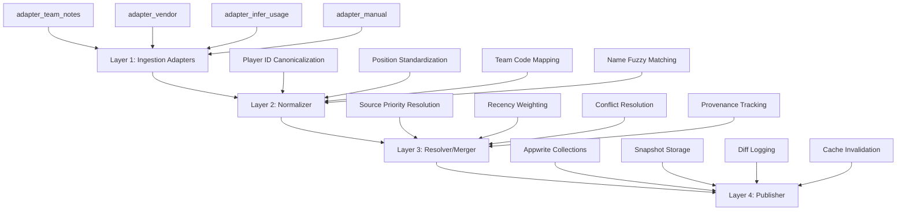

# Data Ingestion Architecture
*College Football Fantasy App - Production Data Pipeline*

## System Objectives (Guarantees)

### Data Freshness & Accuracy
- ✅ Fresh weekly depth charts + starter probabilities per team/position
- ✅ Real-time injury/availability status (OUT/Questionable/Probable) with timestamps  
- ✅ Usage trends (1w/4w EMAs for snaps, routes, carries, targets)
- ✅ Team context (pace, estimated team total, opponent positional strength)

### Data Integrity & Traceability  
- ✅ Complete provenance tracking - know where each field originated
- ✅ Manual override system that always takes precedence
- ✅ Versioned, reproducible snapshots per season/week with merge logs
- ✅ Audit trail for all data changes and sources

## Minimal Viable Data Set

### Core Player Data
```typescript
interface PlayerDepthData {
  // Depth Chart
  depth_chart_rank: number;           // 1 = starter, 2 = backup, etc.
  starter_prob: number;              // 0.0-1.0 probability of starting
  as_of: string;                     // ISO timestamp
  source: DataSource;                // provenance tracking
  
  // Injury Status
  injury_status: 'OUT' | 'QUESTIONABLE' | 'ACTIVE';
  injury_as_of: string;              // ISO timestamp
  injury_note?: string;              // optional detail
  injury_source: DataSource;         // provenance tracking
  
  // Usage Trends (EMAs)
  usage_1w_snap_pct: number;        // 1-week snap percentage
  usage_4w_snap_pct: number;        // 4-week snap percentage
  usage_1w_route_pct: number;       // 1-week route percentage
  usage_4w_route_pct: number;       // 4-week route percentage
  usage_1w_carry_share: number;     // 1-week carry share
  usage_4w_carry_share: number;     // 4-week carry share
  usage_1w_target_share: number;    // 1-week target share
  usage_4w_target_share: number;    // 4-week target share
  
  // Team Context
  team_estimated_plays: number;      // projected team plays per game
  team_run_rate: number;            // team run/pass split
  team_pass_rate: number;           // team pass rate
  opponent_pos_def_rank: number;    // opponent positional defense rank
  
  // Returning Production
  prior_season_target_share: number;  // previous season target share
  prior_season_carry_share: number;   // previous season carry share
  prior_season_yards_share: number;   // previous season yards share
  prior_season_td_share: number;      // previous season touchdown share
  
  // Metadata & Provenance
  provenance_trail: ProvenanceRecord[];
  manual_override?: ManualOverride;   // always wins when present
  created_at: string;
  updated_at: string;
}
```

### Team Context Data
```typescript
interface TeamContextData {
  team_id: string;
  season: number;
  week: number;
  
  // Pace & Volume
  estimated_plays_per_game: number;
  actual_plays_per_game?: number;    // null for future weeks
  pace_rank: number;                 // 1-130 ranking
  
  // Play Calling
  run_rate: number;                  // 0.0-1.0
  pass_rate: number;                 // 0.0-1.0
  red_zone_run_rate: number;        // red zone tendencies
  
  // Opponent Strength
  opponent_team_id: string;
  opponent_def_rank_vs_qb: number;   // defensive ranking vs QB
  opponent_def_rank_vs_rb: number;   // defensive ranking vs RB
  opponent_def_rank_vs_wr: number;   // defensive ranking vs WR
  opponent_def_rank_vs_te: number;   // defensive ranking vs TE
  
  // Game Environment
  estimated_team_total: number;      // Vegas team total if available
  spread: number;                    // point spread
  over_under: number;               // game total
  
  as_of: string;
  source: DataSource;
}
```

## Source Strategy (Priority Order)

### 1. Official Team Sites (Highest Priority)
- **Weekly game notes** - coach quotes, depth chart updates
- **Depth chart PDFs** - official starting lineups
- **Injury reports** - official team injury disclosures
- **Coverage**: All Power 4 teams monitored weekly

### 2. Vendor/Feeds (Medium Priority) 
- **ESPN team depth** - structured depth chart data
- **On3/247 Sports** - roster baselines and recruiting info
- **Coverage**: Available via API when licensing permits

### 3. Statistical Inference (Fallback)
- **Player stats analysis** - 4-game rolling usage scores
- **Snap count tracking** - derive depth from playing time
- **Target/carry trends** - identify usage patterns
- **Coverage**: All tracked players with game data

### 4. Manual Overrides (Always Wins)
- **Camp updates** - preseason depth chart changes  
- **Transfer portal** - mid-season roster moves
- **Breaking injury news** - real-time status updates
- **Coverage**: Manual entry system for urgent corrections

## 4-Layer Architecture



### Layer 1: Ingestion Adapters
**Purpose**: Raw data extraction from heterogeneous sources

#### adapter_team_notes
- Parse PDF depth charts using PDF.js + OCR
- Scrape HTML team pages for injury reports
- Extract coach quotes and game notes
- Output: Raw structured data with source metadata

#### adapter_vendor (Optional/Pluggable)
- ESPN API integration for depth charts
- On3/247 roster data ingestion  
- Other licensed vendor feeds
- Output: Structured vendor data with rate limiting

#### adapter_infer_usage  
- Query player_stats collection for 4-game windows
- Calculate usage scores: snaps, routes, carries, targets
- Infer depth chart ranking from usage patterns
- Output: Statistical depth chart inference

#### adapter_manual
- Admin interface for manual data entry
- Override system for urgent corrections
- Bulk import for preseason depth charts
- Output: Manual overrides with admin provenance

### Layer 2: Normalizer
**Purpose**: Canonicalize and standardize all incoming data

#### Core Responsibilities
- **Player ID Mapping**: Fuzzy match names to college_players.$id
- **Position Standardization**: QB/RB/WR/TE/K canonical positions
- **Team Code Mapping**: Standardize team identifiers across sources
- **Deduplication**: Remove duplicate records within same source
- **Validation**: Schema enforcement and data quality checks

#### Fuzzy Matching Algorithm
```typescript
interface PlayerMatch {
  college_player_id: string;
  confidence: number;        // 0.0-1.0 match confidence
  match_factors: {
    name_similarity: number;
    team_match: boolean;
    position_match: boolean;
    jersey_match?: boolean;
  };
}
```

### Layer 3: Resolver/Merger  
**Purpose**: Intelligent conflict resolution and source prioritization

#### Resolution Strategy
1. **Manual Override Wins**: Always prioritize manual entries
2. **Recency Weighting**: Prefer more recent data within same priority
3. **Source Priority**: team_notes > vendor > inferred > manual_baseline
4. **Conflict Logging**: Record all resolution decisions

#### Provenance Tracking
```typescript
interface ProvenanceRecord {
  field_name: string;
  value: any;
  source: DataSource;
  timestamp: string;
  confidence: number;
  replaced_value?: any;
  replacement_reason: string;
}
```

#### Diff Generation
- Track what changed between ingestion cycles
- Generate human-readable change summaries
- Alert on significant depth chart movements
- Log source attribution for all changes

### Layer 4: Publisher
**Purpose**: Atomically update operational data and create snapshots

#### Publication Targets
1. **Appwrite Operational Collections**
   - `player_depth_charts` - current week depth data
   - `team_context` - current week team data  
   - `injury_reports` - real-time injury status
   - `usage_trends` - EMA-calculated usage metrics

2. **Snapshot Storage**
   - `/snapshots/2025/week-1/` - immutable weekly snapshots
   - `/snapshots/2025/week-1/diffs.json` - change logs
   - Enables rollback and historical analysis

3. **Cache Invalidation**
   - Clear projection caches when depth changes
   - Trigger re-calculation of fantasy points
   - Notify real-time systems of updates

## Implementation Files Structure

```
core/data-ingestion/
├── architecture.md                 # This file
├── schemas/
│   ├── player-depth-data.ts       # Core data interfaces
│   ├── team-context-data.ts       # Team context schemas
│   └── provenance.ts              # Provenance tracking types
├── adapters/
│   ├── base-adapter.ts            # Abstract adapter class
│   ├── team-notes-adapter.ts      # PDF/HTML parsing
│   ├── vendor-adapter.ts          # API integrations
│   ├── stats-inference-adapter.ts # Statistical analysis
│   └── manual-adapter.ts          # Admin overrides
├── normalizer/
│   ├── player-id-mapper.ts        # Fuzzy matching logic
│   ├── position-standardizer.ts   # Position normalization
│   ├── team-code-mapper.ts        # Team standardization
│   └── data-validator.ts          # Schema validation
├── resolver/
│   ├── conflict-resolver.ts       # Priority-based merging
│   ├── provenance-tracker.ts      # Source attribution
│   └── diff-generator.ts          # Change detection
├── publisher/
│   ├── appwrite-publisher.ts      # Database updates
│   ├── snapshot-manager.ts        # Version control
│   └── cache-manager.ts           # Cache invalidation
└── orchestrator.ts                # Main pipeline controller
```

## Data Quality Guarantees

### Validation Rules
- All player IDs must map to existing college_players records
- Depth chart ranks must be 1-5 per position per team
- Starter probabilities must sum to ≤ 1.0 per position
- Usage percentages must be 0.0-1.0
- All timestamps must be valid ISO strings

### Error Handling
- Graceful degradation when sources are unavailable
- Quarantine invalid data for manual review
- Alert administrators on critical parsing failures
- Maintain service availability during source outages

### Performance Targets
- Complete ingestion cycle: < 10 minutes
- Player ID resolution: < 1 second per player
- Conflict resolution: < 5 seconds per team
- Database publication: < 30 seconds atomic update

This architecture ensures reliable, traceable, and reproducible data ingestion for fantasy football projections while maintaining data quality and system performance.