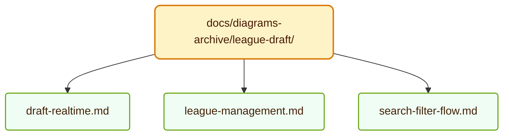

# Project Map — docs/diagrams-archive/league-draft

```mermaid
flowchart TB
  classDef folder fill:#fef3c7,stroke:#d97706,stroke-width:2,color:#451a03,rx:8,ry:8
  classDef file fill:#f0fdf4,stroke:#65a30d,stroke-width:1.5,color:#422006,rx:4,ry:4
  docs_diagrams_archive_league_draft["docs/diagrams-archive/league-draft/" ]
  class docs_diagrams_archive_league_draft folder
  docs_diagrams_archive_league_draft_draft_realtime_md["draft-realtime.md"]
  class docs_diagrams_archive_league_draft_draft_realtime_md file
  docs_diagrams_archive_league_draft --> docs_diagrams_archive_league_draft_draft_realtime_md
  docs_diagrams_archive_league_draft_league_management_md["league-management.md"]
  class docs_diagrams_archive_league_draft_league_management_md file
  docs_diagrams_archive_league_draft --> docs_diagrams_archive_league_draft_league_management_md
  docs_diagrams_archive_league_draft_search_filter_flow_md["search-filter-flow.md"]
  class docs_diagrams_archive_league_draft_search_filter_flow_md file
  docs_diagrams_archive_league_draft --> docs_diagrams_archive_league_draft_search_filter_flow_md
```
