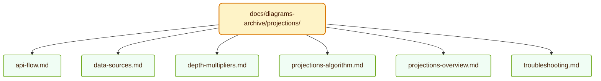

# Project Map — docs/diagrams-archive/projections

```mermaid
flowchart TB
  classDef folder fill:#fef3c7,stroke:#d97706,stroke-width:2,color:#451a03,rx:8,ry:8
  classDef file fill:#f0fdf4,stroke:#65a30d,stroke-width:1.5,color:#422006,rx:4,ry:4
  docs_diagrams_archive_projections["docs/diagrams-archive/projections/" ]
  class docs_diagrams_archive_projections folder
  docs_diagrams_archive_projections_api_flow_md["api-flow.md"]
  class docs_diagrams_archive_projections_api_flow_md file
  docs_diagrams_archive_projections --> docs_diagrams_archive_projections_api_flow_md
  docs_diagrams_archive_projections_data_sources_md["data-sources.md"]
  class docs_diagrams_archive_projections_data_sources_md file
  docs_diagrams_archive_projections --> docs_diagrams_archive_projections_data_sources_md
  docs_diagrams_archive_projections_depth_multipliers_md["depth-multipliers.md"]
  class docs_diagrams_archive_projections_depth_multipliers_md file
  docs_diagrams_archive_projections --> docs_diagrams_archive_projections_depth_multipliers_md
  docs_diagrams_archive_projections_projections_algorithm_md["projections-algorithm.md"]
  class docs_diagrams_archive_projections_projections_algorithm_md file
  docs_diagrams_archive_projections --> docs_diagrams_archive_projections_projections_algorithm_md
  docs_diagrams_archive_projections_projections_overview_md["projections-overview.md"]
  class docs_diagrams_archive_projections_projections_overview_md file
  docs_diagrams_archive_projections --> docs_diagrams_archive_projections_projections_overview_md
  docs_diagrams_archive_projections_troubleshooting_md["troubleshooting.md"]
  class docs_diagrams_archive_projections_troubleshooting_md file
  docs_diagrams_archive_projections --> docs_diagrams_archive_projections_troubleshooting_md
```
