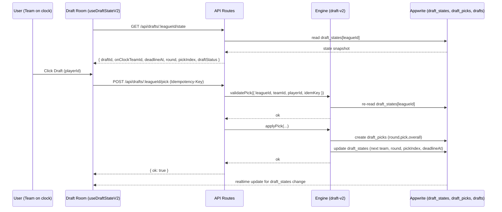

# Diagrams Guide

## Move or update outdated or misplaced diagrams

- Use the plan/apply script (see Index section) to move duplicates and outdated files.
- Project-map entries that don’t render should be regenerated or moved to `functional-flow/` or `system-architecture/`.
- Prefer lightweight `.md` Mermaid. Mix Draw.io (`.drawio`) and Excalidraw (`.excalidraw`) when clarity requires.

## Remove duplicates

- Keep one canonical copy under `docs/diagrams/`.
- For renamed/moved diagrams, leave a short stub pointing to the new path.

## What goes where

- functional-flow/: user flows (signup, join league, create league, draft)
- project-map/: canonical domain diagrams organized into four folders per domain:
  - overview/
  - user-flow/
  - data-and-entity-relation/
  - api-and-events/
- system-architecture/: end-to-end data flow, projections, realtime, background jobs
- public/: assets exported for docs or blog

## Conventions

- Filenames: kebab-case, short, specific (e.g., `join-league.md`)
- Versions: append `-v2`, `-2025-09-01` if materially different
- Frontmatter (optional): title, updated, source

## Size & Index

- Size budget: 80–120 lines per diagram
- Canonical index: `docs/diagrams/project-map/_inventory.json`

## Index (auto-generated by script)

- Run: `npm run diagrams:plan` to preview moves and `npm run diagrams:apply` to apply.
- The script writes an inventory to `docs/diagrams/_inventory.json` and updates this README list.

### Draft v2 Core Flow (Mermaid)

